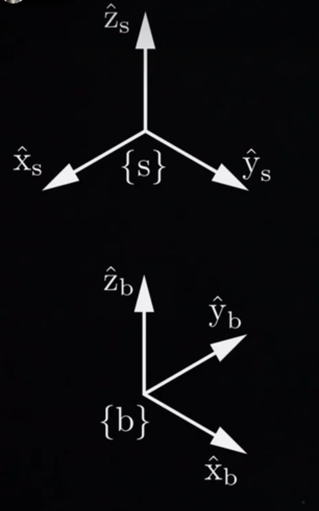
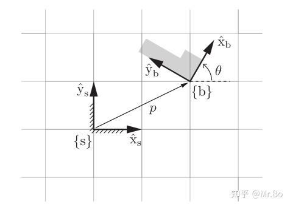
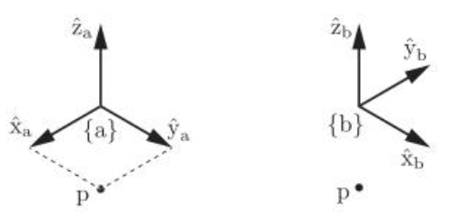
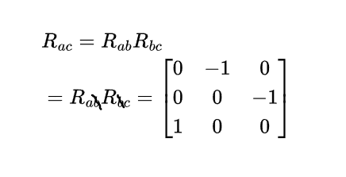
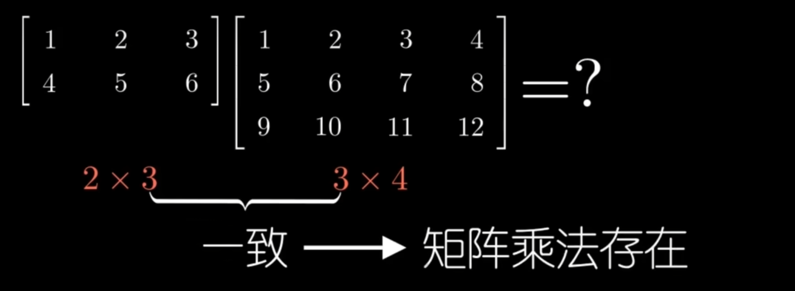
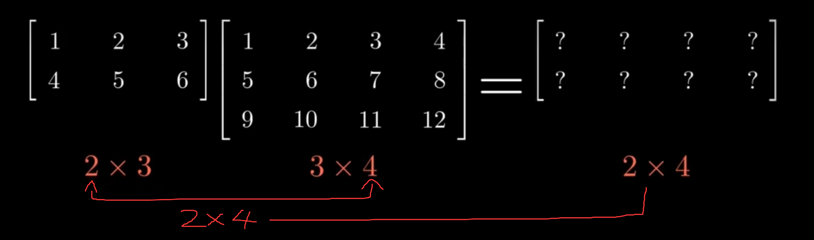
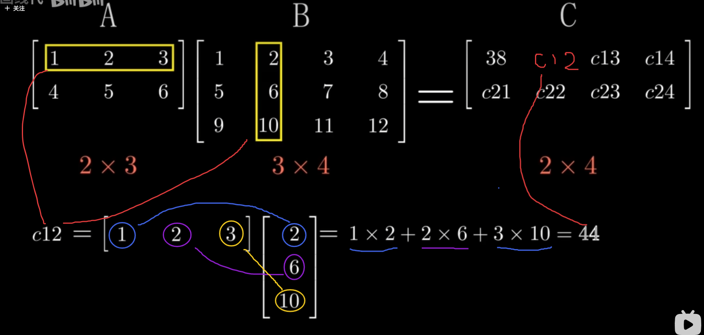
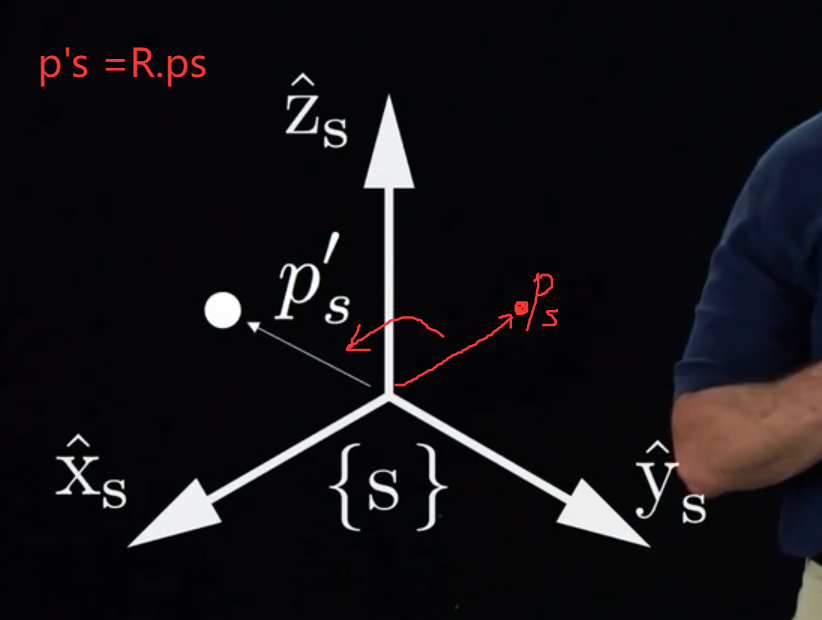
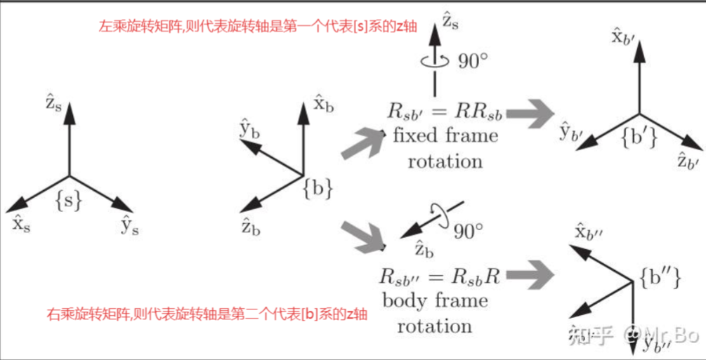

## 旋转矩阵
### 旋转矩阵R的主要是充当两个矩阵之间转换的“桥梁！”

主要作用：

1：表示坐标系相对与别的坐标系的**姿态**

2：改变向量或坐标系的参考系，即**参考系的转换**

3：旋转一个向量或坐标系

>注意：在第一种作用中R有本身的意义代表一种坐标系的姿态，而在第二和第三种作用中，R主要充当算子的作用
### 旋转矩阵的构成

- 写出新坐标系的单位轴向量（看在原坐标系中新坐标系的坐标轴如何表示），然后按列拼接：

【1】对于规规矩矩的坐标系来说：

直接看就可以了，比如这里原坐标系是{s}，新坐标系是{b}那么新坐标系{b}的x轴上的单位轴向量你就看在原坐标系上的向量是多少，比如这里$\hat{\mathbf{x}}_{\mathrm{b}}$就是在原坐标系{s}上的[0,1,0]。

然后旋转矩阵就是把$\hat{\mathbf{x}}_{\mathrm{b}}$.....这些拼起来，因为$\hat{\mathbf{x}}_{\mathrm{b}}$本身就是列矩阵，所以是按列拼接的

$$
\begin{gathered}
\hat{\mathrm{x}}_{\mathrm{b}}=\left[\begin{array}{l}
0 \\
1 \\
0
\end{array}\right] \quad \hat{\mathrm{y}}_{\mathrm{b}}=\left[\begin{array}{c}
-1 \\
0 \\
0
\end{array}\right] \quad \hat{\mathrm{z}}_{\mathrm{b}}=\left[\begin{array}{l}
0 \\
0 \\
1
\end{array}\right]\\
R_{s b}=\left[\hat{\mathrm{x}}_{\mathrm{b}} \hat{\mathrm{y}}_{\mathrm{b}} \hat{\mathrm{z}}_{\mathrm{b}}\right]=\left[\begin{array}{ccc}
0 & -1 & 0 \\
1 & 0 & 0 \\
0 & 0 & 1
\end{array}\right]
\end{gathered}
$$

>注意的是,$R_{s b}$代表的是后面那个下标通往前面那个前面那个下标的桥梁，即b通往s的桥梁

>但是可以通过“转置”或“逆矩阵”的方法得到逆向的桥梁，如$$
R_{a c}=\left[\begin{array}{ccc}
0 & -1 & 0 \\
0 & 0 & -1 \\
1 & 0 & 0
\end{array}\right], \quad R_{c a}=\left[\begin{array}{ccc}
0 & 0 & 1 \\
-1 & 0 & 0 \\
0 & -1 & 0
\end{array}\right]
$$
> $$
R_{a c}=R_{c a}^{-1}=R_{c a}^{\mathrm{T}}
$$

【2】对于歪歪扭扭的坐标系来说

新坐标系的坐标轴$\hat{\mathbf{x}}_{\mathrm{b}}$可以在原坐标系中表示为如下，然后因为是单位轴向量的原因，所以只剩下cos和sin：
$$
\hat{\mathbf{x}}_b=\cos \theta \cdot \hat{\mathbf{x}}_s+\sin \theta \cdot \hat{\mathbf{y}}_s=\left[\begin{array}{c}
\cos \theta \\
\sin \theta
\end{array}\right]
$$
类似的$\hat{\mathbf{y}}_{\mathrm{b}}$
$$
\hat{\mathbf{y}}_b=-\sin \theta \cdot \hat{\mathbf{x}}_s+\cos \theta \cdot \hat{\mathbf{y}}_s=\left[\begin{array}{c}
-\sin \theta \\
\cos \theta
\end{array}\right]
$$

组装旋转矩阵 $R$,将动系 $\{b\}$ 的基向量作为列向量排列。因此：
$$
R=\left[\begin{array}{ll}
\hat{\mathbf{x}}_b & \hat{\mathbf{y}}_b
\end{array}\right]=\left[\begin{array}{cc}
\cos \theta & -\sin \theta \\
\sin \theta & \cos \theta
\end{array}\right] .
$$
关于旋转矩阵R,有个性质，它的逆矩阵等于转置
$$R_{de}=R_{ed}^{-1}=R_{ed}^\mathrm{T}$$

### 旋转矩阵的主要作用

【1】表示坐标系相对与别的坐标系的**姿态**：

例如图中 $R_{a b}=\left[\begin{array}{ccc}0 & -1 & 0 \\1 & 0 & 0 \\0 & 0 & 1\end{array}\right]$
这种单独的旋转矩阵表示了{b}坐标系相对与{a}坐标系的姿态

【2】改变向量或坐标系的参考系，即**参考系的转换**

例如还有一个{c}坐标系相对于{b}坐标系的旋转矩阵

$R_{b c}=\left[\begin{array}{ccc}0 & 0 & -1 \\0 & 1 & 0 \\1 & 0 & 0\end{array}\right]$

那我们相当于知道了从{b}如何通往{a}，也知道了从{c}如何通往{b}。我们就可以做简单的乘法来获得从{c}通往{a}的桥梁

两个头尾相连的下标可以消去，所以b消去只剩ac

对于向量的参考系转换也一样：

要将上面图中{b}坐标系中点 $p$ 从 $\{b\}$ 系的坐标 $p_b$ 转换到 $\{a\}$ 系的坐标 $p_a$ ，是通过旋转矩阵 $R_{a b}$ 相乘实现的：
$$
p_a=R_{a b} \cdot p_b
$$
而由上文可得：
$$
R_{a b}=\left[\begin{array}{ccc}
0 & -1 & 0 \\
1 & 0 & 0 \\
0 & 0 & 1
\end{array}\right], \quad p_b=\left[\begin{array}{c}
1 \\
-1 \\
0
\end{array}\right]
$$

$$
\begin{aligned}
&\mathbf{p}_a=R_{a b} \cdot \mathbf{p}_b\\
&\left[\begin{array}{l}
1 \\
1 \\
0
\end{array}\right]=\left[\begin{array}{ccc}
0 & -1 & 0 \\
1 & 0 & 0 \\
0 & 0 & 1
\end{array}\right] \cdot\left[\begin{array}{c}
1 \\
-1 \\
0
\end{array}\right]
\end{aligned}
$$

>关于矩阵乘法，复习一下：矩阵乘法的前提是左列数=右行数
>
>
> 而结果矩阵的大小是左行数*右列数
> 
>
>
>计算过程是
> 
>

【3】旋转一个向量或坐标系

可以由上图看出{b}坐标系是由{s}坐标系绕z轴旋转90°得来的

（关于旋转方向，按右手定则。大拇指指向正方向，其它手指环绕的就是旋转方向）
则$R_{sb}$也可以写成
$$R_{sb} = R = \operatorname{Rot}(\hat{z}, 90^\circ)$$

具体的内容还是通过前面旋转矩阵的构成来计算出来，只是可以表达成这样。

则原来向量的参考系变化也可以表达为向量的旋转。因为参考系之间本身就是旋转关系，所以向量也是旋转关系

对于坐标系来说也可以按旋转矩阵来旋转变化

