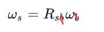
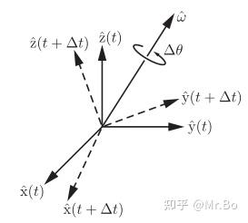

关键的两个核心公式

>前提：空间内有两个坐标系，分别是定系{s}（静止的观察者）和动系{b}（固定在刚体上的观察者），而有一个刚体在旋转其旋转轴和角速度大小是客观存在的。然后这两个$\omega_s$和$\omega_b$本质是对这同一个物理旋转在不同坐标系的不同观测结果。数据可能不同，但是描述的是同一个物理旋转。而这时候$R_{s b}$（后面简写成R）就可以充当两者之间的翻译官

1.**角速度与旋转矩阵的关系**:

$$
\begin{array}{l}
[\omega_s] &= \dot{R}R^{-1} \quad \text{（定系 {s} 中的角速度）} \\
[\omega_b] &= R^{-1}\dot{R} \quad \text{（动系 {b} 中的角速度）}
\end{array}
$$
>可以理解为：R是代表空间中的旋转运动，而该旋转运动对时间求导$\dot{R}$正常就是代表角速度，但是这里没有那么简单。而结合[[3.1 旋转矩阵]]中最后的矩阵左乘是代表第一个下标而右乘是代表第二个下标的知识，这里的R暗指的就是$R_{s b}$，所以$R^{-1}$就是$R_{b s}$，左乘就是代表第一个下标{b}中的角速度，右乘就是代表第二个下标{s}中的角速度

2.**角速度的坐标系转换**:
$$\begin{aligned}
 & \omega_{b}=R^{-1}\omega_s=R^\top\omega_s \\
 & \omega_{s}=R\omega_{b}
\end{aligned}$$
>可以理解为下标相消，

### 推导过程：

角速度$\omega=\hat{\omega}\dot{\theta}$
>角速度分为两部分：
>- 转轴方向：用单位向量 $\hat{\omega}$ 表示（右手定则）。
>- 转动快慢：用角速度大小$\dot{\theta}$表示（即角度 θ 对时间 t 的导数，$\dot{\theta}=\frac{d\theta}{dt}$​）
>
>$\hat{\omega}$代表该方向上的单位向量

而R(t) 的每一列是动系 {b} 的坐标轴在定系 {s} 中的方向向量：
$$R(t)=
\begin{bmatrix}
r_1(t) & r_2(t) & r_3(t)
\end{bmatrix},\quad\text{其中 }r_i(t)\text{ 是 }\{b\}\text{ 的 }x,y,z\text{ 轴在 }\{s\}\text{ 中的表示}.$$
而当刚体以$\omega$角速度旋转时，则任意向量$r_1(t)$的变化速度（即速度）：由旋转的线速度公式$v=w\cdot r$可得：$$\dot{r}_i(t)=\omega_s\times r_i(t)$$把每一列的导数组合起来，得到$\dot{R}(t)$，这个表示动系各坐标轴方向向量在定系中的瞬时变化速度
$$\dot{R(t)}=[\omega_s\times r_1,\omega_s\times r_2,\omega_s\times r_3]=\omega_s\times R$$

因为要处理很多叉乘的问题，所以引入一个规则：
$$x\times y=[x]y$$
这个$[x]$叫**斜对称矩阵**，它是由下面公式变换而来：
$$x=
\begin{bmatrix}
x_1 \\
x_2 \\
x_3
\end{bmatrix}\in\mathbb{R}^3,[x]=
\begin{bmatrix}
0 & -x_3 & x_2 \\
x_3 & 0 & -x_1 \\
-x_2 & x_1 & 0
\end{bmatrix}$$
对于斜对称矩阵A来说，有个性质$A=-A^T$

所以根据斜对称矩阵的变换得
$$\dot{R}(t)=[\omega_s]R$$

接下来通过一系列计算可以得出那两个核心公式

