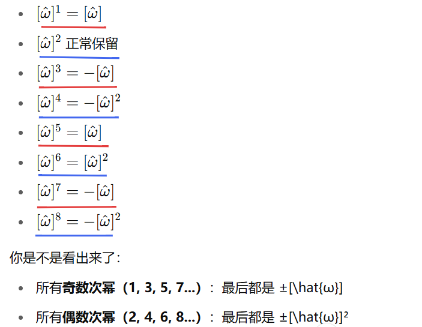

  旋转的指数坐标就是*用“旋转轴 + 旋转角度”来描述一个旋转动作*。
旋转轴为$\hat{\omega}$,旋转角度是$\theta$，这俩信息合起来就叫”指数坐标“$$\hat{\omega}\theta$$
指数坐标只是旋转的另一种表达罢了，它与[[3.1 旋转矩阵]]存在着可以互相求出的关系

- 1，通过 **Rodrigues 公式**，从指数坐标求旋转矩阵
$$R=e^{[\hat{\omega}]\theta}=I+\sin\theta[\hat{\omega}]+(1-\cos\theta)[\hat{\omega}]^2$$
    这就是从“轴+角度”→旋转矩阵的转换

- 2，通过**矩阵对数**，从旋转矩阵求指数坐标 $$\begin{gathered}
\theta=\arccos\frac{\mathrm{trace}(R)-1}{2} \\ \\
[\hat{\omega}]=\frac{R-R^{\top}}{2\sin\theta}
\end{gathered}$$
	这就是从旋转矩阵→“轴+角度”的转换

###  【1】Rodrigues 公式的推导：

>高数知识复习一下,线性微分方程和向量微分方程：有这样的一个方程，初始条件为$$x_{(0)}=x_{0}且\dot{x(t)}=ax(t)$$由微分和积分的知识可推：1. 分离变量将方程改写为:
>$$\frac{dx}{x} = a dt.$$2. 两边积分:
>$$
\int \frac{1}{x} dx = \int a dt \quad \Rightarrow \quad \ln |x| = at + C.$$
>3. 解出 $x(t)$:
>$$x(t) = e^{at + C} = e^C e^{at}.$$
>4. 代入初始条件:
  当 $t=0$ 时, $x(0) = e^C = x_0$, 所以 $e^C = x_0$.所以最终解:
>$$
		x(t) = x_0 e^{at}.$$>$$x(\begin{array}{c}t\end{array})=e^{at}x_0$$  同时$e^{x}$有一个统一的展开式：$$e^{at}=1+at+\frac{at^2}{2!}+\frac{at^3}{3!}+\ldots\ldots.$$  现在升级到向量版本，$x(t)$不是一个数，而是一个向量$\text{比如 }[x_1(t),x_2(t)]^\top$表示二维平面上的位置。那么此时条件则变为$$\dot{x(t)}=Ax(t),\quad x(0)=x_0$$   这里A 是一个 矩阵（比如 2×2 的表格），表示 $x(t)$中每个分量如何互相影响。
>类比普通情况可以求得向量版本的解为：
>$$x(t)=e^{At}x_0$$这里的$e^{At}$是 矩阵指数，展开成级数：$$e^{At}=I+At+\frac{(At)^2}{2!}+\frac{(At)^3}{3!}+\cdots $$

热身完毕，接下来，如下图所示，向量$p(0)$绕轴经过时间t旋转$θ$$为$$p(\theta)$
![[15.png]]
$$\dot{p}=\hat{\omega}\times p=\left[\hat{\omega}\right]p$$
>线速度 $\dot{p}$  等于旋转轴方向的角速度向量$ω$跟点的位置$p$的叉积
>$$\dot{p} = \omega \times p$$   如果这个角速度的方向是单位向量 $\hat{\omega}$，大小是转速 $\dot{\theta}$，那就写成：$$
\omega = \hat{\omega} \cdot \dot{\theta}$$   所以线速度就是：$$\dot{p} = \omega \times p = (\hat{\omega} \cdot \dot{\theta}) \times p$$   有时我们会省略 $\dot{\theta}$，默认包含在 $\omega$ 里，所以简写成：$$
\dot{p} = \hat{\omega} \times p$$

这个式子$\dot{p}=\left[\hat{\omega}\right]p$的格式与之前复习的向量微分方程格式如出一辙，因此它的解为：
$$p\:(\:t\:)\:=\:e^{[\hat{\omega}]t}p(0)$$
那意味着$p(0)$绕轴旋转后的新位置为：
$$p(\theta)=e^{[\hat{\omega}]\theta}p(0)$$
此时中间这个$e^{[\hat{\omega}]\theta}$是关键，它就是一个“旋转矩阵”，因为根据旋转矩阵的第三个用法，旋转矩阵可以充当旋转的一个算子，此处$e^{[\hat{\omega}]\theta}$前后连接的就是旋转始末两个状态。

依旧是根据上面复习的高数内容，把$e^{[\hat{\omega}]\theta}$展开$$e^{[\hat{\omega}]\theta}=I+[\hat{\omega}]\theta+\frac{[\hat{\omega}]^2\theta^2}{2!}+\frac{[\hat{\omega}]^3\theta^3}{3!}+\cdots$$根据$[\hat{\omega}]$的性质可以归纳整理出斜对称矩阵的高次幂是循环的

接下来分组整理一下$$e^{[\hat{\omega}]\theta}=I+(一堆奇数次幂)[\hat{\omega}]+(一堆偶数次幂)[\hat{\omega}]^2$$它写出来的就是：
$$e^{[\hat{\omega}]\theta}=I+\left(\theta-\frac{\theta^3}{3!}+\frac{\theta^5}{5!}-\cdots\right)\cdot[\hat{\omega}]+\left(\frac{\theta^2}{2!}-\frac{\theta^4}{4!}+\cdots\right)\cdot[\hat{\omega}]^2$$

再根据sin的泰勒展开：$\sin\theta=\theta-\frac{\theta^3}{3!}+\frac{\theta^5}{5!}-\frac{\theta^7}{7!}+\cdots$
cos的泰勒展开：$\cos\theta=1-\frac{\theta^2}{2!}+\frac{\theta^4}{4!}-\frac{\theta^6}{6!}+\cdots$
那么$1-\cos\theta=\frac{\theta^2}{2!}-\frac{\theta^4}{4!}+\frac{\theta^6}{6!}-\cdots$

所以之前的那个式子可以写成：$$R=e^{[\hat{\omega}]\theta}=I+\sin\theta\cdot[\hat{\omega}]+(1-\cos\theta)\cdot[\hat{\omega}]^2$$这就是所谓的 **Rodrigues 公式** 👆
把指数坐标（轴和角度）转换成旋转矩阵

### 【2】矩阵对数

>这个名词有点抽象，先讲一下它的意思。我们平常知道"指数"和"对数"是一对反操作，
>比如指数：$\dot e^x=y$
>那么对数就是$\ln y=x$
>矩阵也能做"指数"操作：
>$R=e^A$ 
>矩阵对数就是给你一个旋转矩阵$R$,问你：
>有没有个矩阵$A$,满足$e^A=R?$
>这个$A$就叫$R$的"对数",记作$\log R$。
>而我们根据上面Rodrigues 公式可知$R=e^{[\hat{\omega}]\theta}$
>因此比如你有旋转矩阵 $R$（比如机器人的旋转状态
>而你反过来想知道它“绕哪个轴、转了多少角度”
>那么这个信息就在矩阵对数 $A$ 里（$A=[\hat{\omega}]\theta$）
  
  - 先利用迹求角度，旋转矩阵的迹(对角元素之和)有个妙用：$$\mathrm{trace}(R)=1+2\cos\theta $$这个公式告诉我们：$$\cos\theta=\frac{\operatorname{trace}(R)-1}2$$**所以通过计算$\operatorname{trace}(R)$旋转矩阵的迹,你就能直接得到旋转角度 $\theta$👆**
  而矩阵的迹就是把它主对角线上的元素全加起来，比如$\mathrm{trace}(R)=r_{11}+r_{22}+r_{33}$
  

  - 再来求旋转轴：$$[\hat{\omega}]=\frac{R-R^\top}{2\sin\theta}$$
>关于旋转矩阵的迹跟cos角度有关的事情，还有这个旋转轴的公式其实还有公式推导，在这里就不推了，直接记结论公式就好了

合起来就是矩阵对数：$$\log R=[\hat{\omega}]\theta=\frac{\theta}{2\sin\theta}(R-R^\top)$$
把一个旋转矩阵变成“旋转轴×旋转角”的形式

>需要注意的是，因为这个公式有除以$\sin\theta$所以需要考虑特殊情况，也就是除数为0的情况
>$θ$ = $0$：没旋转，对数是零矩阵
>$θ$= $π$：180度旋转，$\sin\theta = 0$，需要用其他方式