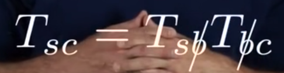

## 变换矩阵的定义

它是一个 4×4 的大矩阵，能同时表示 **旋转 + 平移** 这两种操作
$$T=
\begin{bmatrix}
R & p \\
0 & 1
\end{bmatrix}=
\begin{bmatrix}
r_{11} & r_{12} & r_{13} & p_{1} \\
r_{21} & r_{22} & r_{23} & p_{2} \\
r_{31} & r_{32} & r_{33} & p_{3} \\
0 & 0 & 0 & 1
\end{bmatrix}$$
左上角的 3×3 矩阵 R，是*旋转矩阵*，控制“方向上的旋转”
右上角的 3×1 向量 p，是*平移向量*，控制“移动到哪去”
最后一行 $\begin{bmatrix}0 & 0  & 0  & 1\end{bmatrix}$，是个固定格式，用来让矩阵乘法能顺利进行

>这是三维空间内的变换矩阵，当然二维平面内就是：$T= \begin{bmatrix} R & p \\ 0 & 1 \end{bmatrix}= \begin{bmatrix} r_{11} & r_{12} & p_1 \\ r_{21} & r_{22} & p_2 \\ 0 & 0 & 1 \end{bmatrix}$

变换矩阵有几个性质：
- 变换矩阵的逆矩阵：$T^{-1}= \begin{bmatrix} R & p \\ 0 & 1 \end{bmatrix}^{-1}= \begin{bmatrix} R^\mathrm{T} & -R^\mathrm{T}p \\ 0 & 1 \end{bmatrix}$
- 两个变换矩阵的乘积也是变换矩阵：$T_1T_2\in SE(3)$
- 矩阵乘法满足结合律，但不满足交换律：$$\begin{aligned}
 & (T_1T_2)T_3=T_1(T_2T_3) \\ \\
 & T_1T_2\neq T_2T_1
\end{aligned}$$

## 变换矩阵的三个作用

与[[3.1 旋转矩阵]]中旋转矩阵的功能类似

### 【1】表示位形

![[17.png]]

如图，令固定坐标系 $\{s\}$ 与 $\{a\}$ 重合，
坐标系 $\{a\}$、$\{b\}$ 和 $\{c\}$ 分别通过下列变换相对于 $\{s\}$ 表示:
- $T_{sa} = (R_{sa}, p_{sa})$
- $T_{sb} = (R_{sb}, p_{sb})$
- $T_{sc} = (R_{sc}, p_{sc})$

也就是说，*这些坐标系相对于 $\{s\}$ 的旋转和位置分别由这些变换矩阵描述。*

### 【2】改变某一向量或坐标系的参考坐标系

类似的下标相消原则，已知$T_{s b}$和$T_{b c}$的，就可以通过

对于向量来说，因为变换矩阵是4×4的，而坐标系里的向量是3×1的，他们并不能相乘（左行数不等于右列数）。因此只要把向量末尾加上1，就能使得向量变为4×1的，也称*齐次坐标*：$\mathbf{x}_h= \begin{bmatrix} x \\ y \\ z \\ 1 \end{bmatrix}$

这样就能实现向量参考系的变换

### 【3】移动（旋转+平移）向量或坐标系

接下来会引入两个T变换矩阵，因此在这里对它们进行一个区分。

$T_{s b}$这种带下标的变换矩阵，表示一个*具体场景下的变换*，例如在这个图中代表的是从{s}系变换到{b}系这个操作

而$T$这种不带下标的就是*通用的变换逻辑*，它是一个打包好的变换逻辑，需要注意的就是它暂时未指定这些操作是相对于哪个坐标系

例如$T$由以下两个变换组成：沿y轴平移两个单位，沿z轴旋转90°$$p=[0
\begin{array}
0 & 2 & 0
\end{array}]^\mathrm{T},\hat{\omega}=\hat{\mathrm{z}},\theta=90^\circ$$
**左乘与右乘**：

>此时我们只关心$T$的操作

对于**左乘**来说，也就是$T_{sb^{\prime}}=TT_{sb}$，就是把 $T$ 中的旋转轴 $ω$ 和平移向量 $p$ 绑定到 $T_{s b}$的**第一个下标坐标系** $\{s\}$中。并且**先旋转再平移**，如下图第一个

![[Pasted image 20250621232818.png]]

对于**右乘**来说，也就是$T_{sb^{\prime\prime}}=T_{sb}T$，就是把 $T$ 中的旋转轴 $ω$ 和平移向量 $p$ 绑定到 $T_{s b}$的**第二个下标坐标系** $\{b\}$中。并且**先平移再旋转**，如上图第二个