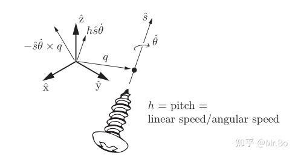

【先引入一下这个单位螺旋轴S的意义。
- 1，螺旋运动：
	也就是S最基本的表达式$S=\{q,\hat{s},h\}$，如图所示，$\hat{s}$代表了这个螺旋运动的旋转轴，$h$是螺距，其等于线速度/角速度。$q$是螺旋轴上任意一点，它主要的意义在数学运算的时候辅助其它元素进行计算

- 2，螺旋轴的意义：
	*空间中的任何一种移动都可以看作螺旋运动*，因为螺旋运动本身就复合了旋转和平移。
	因此可以通过运动旋量$V$(其代表现在的运动状态)来还原出这个运动状态的源头，即螺旋运动的源头表达$S$

- 3，S的常用写法和”单位“的含义：
	通常我们不把S写成上述那种表达式，因为它不好直接参与计算。我们把它加入一个”单位“的概念写成👇$$S=
\begin{bmatrix}
\omega \\
v
\end{bmatrix} \quad \quad \quad \text{其中}||\omega||=\dot{\theta}=1$$这里两对竖线的意思是用于向量的模长（普通一对竖线通常用于普通数字的取绝对值），即”单位“的意思就是角速度的模长=1，即$\dot{\theta}=1$，因为角速度里面除了转速$\dot{\theta}$还包含了转轴$\hat\omega$。$$[S]=\begin{bmatrix}
[\omega_b] & v_b \\
0 & 0
\end{bmatrix}$$注意$[S]$的意思也是跟[[3.5 运动旋量]]一样，只是矩阵表达法。

- 4，从$V$逆推$S$：
		依旧是上面那个图，$V$代表了上图中那个坐标系的瞬时运动状态。那把坐标系的运动看作绕螺丝轴的螺旋运动，即$$V=
\begin{bmatrix}
\omega \\
v
\end{bmatrix}=
\begin{bmatrix}
\hat{s}\dot{\theta} \\
-\hat{s}\dot{\theta}\times q+h\hat{s}\dot{\theta}
\end{bmatrix}$$角速度是很基础的公式$\omega=\hat{\omega}\dot{\theta}$。线速度的第二部分$h\hat{s}\dot{\theta}$是因旋转螺距 $h$ 产生的轴向平移速度。第一部分$v_\text{绕着轴转}=\omega\times q=(\hat{s}\dot{\theta})\times q$
		但是注意！我们是想知道坐标原点随着这个轴转的时候的线速度，而原点相对轴上点$q$是“负方向”,所以要加个负号：$$v_\text{旋转部分}=-\hat{s}\dot{\theta}\times q$$因为$S$是一个”单位“螺旋轴，$||\omega||=\dot\theta=1$所以代入上面那个式子得👇：$$\color{#fb8b05}\left.\mathcal{S}=\left[
\begin{array}
{c}\omega \\
v
\end{array}\right.\right]=
\begin{bmatrix}
\hat{s} \\
-\hat{s}\times q+h\hat{s}
\end{bmatrix}$$这是$S$的*常用表达式

>若只有旋转没有平动，就是h=0的情况

- 5，运动旋量$V$与单位螺旋轴$S$：
		类比刚体转动的公式$\omega=\hat{\omega}\dot{\theta}$，总的转动速度角速度=转轴×转的速度大小。
		*一般刚体运动就可以如下表示*👇$$\color{#fb8b05}\mathcal{V}=\mathcal{S}\dot{\theta}$$也是转轴×转的速度大小

- 6，单位螺旋轴的参考系变换：
		如果$S_a$是在坐标系$\{a\}$下表示的单位螺旋轴，$S_b$是在坐标系$\{b\}$下表示的，它们之间的关系就是：$$\color{#fb8b05}S_a=\mathrm{Ad}_{T_{ab}}\cdot S_b$$与运动旋量类似

- 7，S的白话理解：
		$V$代表了你当前实际在跑的速度，跑多块，往哪跑。
		$S$不仅代表了*你跑的那条“路”！*，也可以通过”单位“的概念表示为”*你在这条路上迈出一步时，对应的方向和推进量*“
		因此式子中的$\dot{\theta}$就代表了你“每秒走多少步”