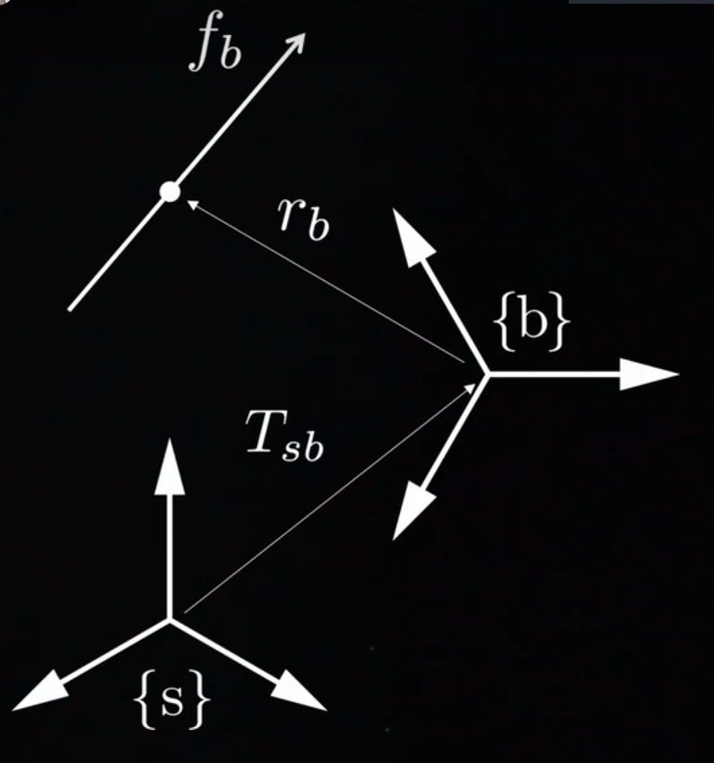
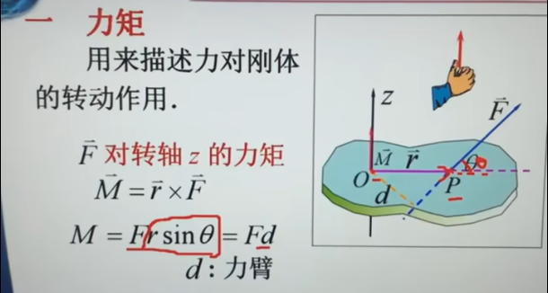

力旋量及其坐标变换公式：$$\color{#fb8b05}\mathcal{F}_{a}=(m_{a},f_{a})=[\mathrm{Ad}_{T_{ba}}]^{T}\mathcal{F}_{b}=[\mathrm{Ad}_{T_{sb}}]\mathcal{F}_b$$
- 推导：
如图所示，考虑作用在刚体上一点某点r的线性力$f_b$（参考系是{b}），定义定系为 {s} ，动系为 {b}

则这个力相对于{a}系产生的力矩为：$m_a=r_a\times f_a$

>关于力矩复习一下，它是力向量和力臂向量的叉乘，方向由右手定则确定。核心是描述力对刚体的转动作用。
>

类似[[3.5 运动旋量]]，把力矩和力打包成一个6×1的向量，称为*力旋量*：$$F_a=
\begin{bmatrix}
m_a \\
f_a
\end{bmatrix}$$因此*力旋量的参考系转换*，也可以类似地用伴随矩阵来算，还是利用下标相消的原理：$$\mathcal{F}_s=[\mathrm{Ad}_{T_{bs}}]^\mathrm{T}\mathcal{F}_b=[\mathrm{Ad}_{T_{sb}}]\mathcal{F}_b$$

