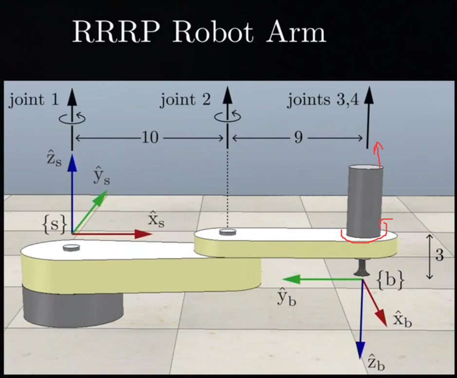
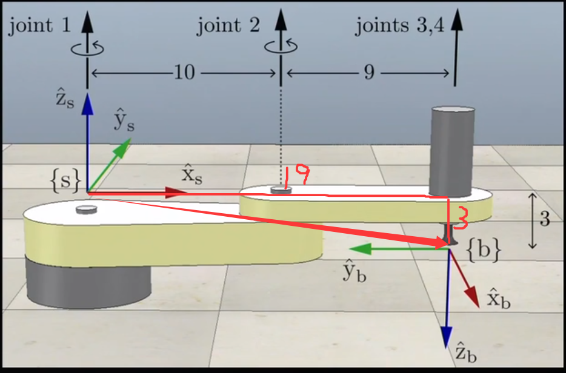

>目标是：已知各关节坐标→求解末端的姿态

指数积公式（$PoE$）：

- 1，相对于基坐标系（Space Form）：$$\color{#fb8b05}T(\theta)=e^{[\mathcal{S}_1]\theta_1}e^{[\mathcal{S}_2]\theta_2}\cdots e^{[\mathcal{S}_n]\theta_n}M$$
- 2，相对于动坐标系 （Body Form）：$$\color{#fb8b05}T(\theta)=Me^{[\mathcal{B}_1]\theta_1}e^{[\mathcal{B}_2]\theta_2}\cdots e^{[\mathcal{B}_n]\theta_n}$$
>这里的的定系和动系其实影响的就是这里$T$，$S$的相对参考系
>
>	$M$：所有关节都处于初始状态时，末端相对于基坐标系的位姿矩阵（$T=(R,p)$）
>	
>	$S$：每个关节相对于基坐标系or动坐标系的$S$（$S=\begin{bmatrix}\omega \\v\end{bmatrix}$）
>		当相对于动坐标系时，记成$\mathrm{B}$（其实也是$B=\begin{bmatrix}\omega \\v\end{bmatrix}$只是这里$\omega$和$v$相对的坐标系是动坐标系而已）
>	
>	$T$：末端的位姿矩阵，只不过参考系不一样，
>		相对于基坐标系时，像是“站在地上看你一步步变换之后，到了哪儿。”
>		相对于动坐标系时，像是“站在自己身上，看自己是怎么从初始姿态 M，动到现在这个状态的。”

>因为$M$放的位置不同，所以为了方便记忆：
>	相对基坐标系来说，$M$在远处，像是$M$从最远端关节逐渐变换到最近端关节
>	相对动坐标系来说，$M$在近处，像是$M$从最近端关节逐渐变换到最远端关节

D-H法：
$$T_{04}=T_{01}T_{12}T_{23}T_{34}$$通过下标相消法来求出末端相对于基端的位姿。其中每个$T$都是一个关于$\theta$变量的函数，因为不同角度，每个关节相对于上一个关节的位姿就不一样，$T$就不一样。但是这种方法构建复杂，所以一般不用。

## 用一道例题来讲解一下具体的计算过程：

三个旋转关节加一个平移关节组成的机械臂：

### 【1】求初始状态$M$：
如图就是该机械臂的最初始状态。因为不管是body form还是space form，
$M$*都是末端相对于基坐标系！*
所以根据$M$其实就是位姿矩阵，$M=\begin{bmatrix}R & p \\0 & 1\end{bmatrix}$
- （1），先求$R$，其实就是看末端坐标系相对于基坐标系的变换，详见[[3.1 旋转矩阵]]
$$R=\begin{bmatrix}0 & -1 & 0 \\ -1 & 0 & 0\\0 & 0 & -1\end{bmatrix}$$坐标系{b}的x轴在基坐标系{s}y轴的负方向上，所以$R$的第一列是$\begin{bmatrix}0 \\ -1 \\ 0\end{bmatrix}$

坐标系{b}的y轴在基坐标系{s}x轴的负方向上，所以$R$的第二列是$\begin{bmatrix}-1 \\ 0 \\ 0\end{bmatrix}$

坐标系{b}的z轴在基坐标系{s}z轴的负方向上，所以$R$的第三列是$\begin{bmatrix}0 \\ 0 \\ -1\end{bmatrix}$

- （2），再求$p$，就是看从基坐标系{s}到末端坐标系{b}的向量。

这个向量相对于基坐标系来说的坐标是$\begin{bmatrix}19 \\ 0 \\ -3\end{bmatrix}$

- （3），拼接起来，组成$M$
$$M=
\begin{bmatrix}
0 & -1 & 0 & 19 \\
-1 & 0 & 0 & 0 \\
0 & 0 & -1 & -3 \\
0 & 0 & 0 & 1
\end{bmatrix}$$

### 【2】逐个关节求$S$ or $B$：

- （1）对于关节1来说：
	先按space form来求$S$：因为$S=\begin{bmatrix}\omega \\v\end{bmatrix}$所以先求$\omega$：
		这个其实就是*看这个关节旋转的方向，然后根据右手定则确定出它角速度的真实方向，再跟定系or动系比较*：
		如图所示，关节1的旋转方向已经给出，那么根据右手定则，它的角速度方向就是朝上，因为是求$S$，所以跟定系比较，发现角速度方向于{s}系的z轴正方向一致，所以$\omega=\begin{bmatrix}0 \\ 0 \\ 1\end{bmatrix}$
		而求$v$，这里就是*求这个旋转动作在{s}系or{b}系原点处产生的线速度*。因为这个关节一就在这个轴上，所以它的线速度就是$v=\begin{bmatrix}0 \\ 0 \\ 0\end{bmatrix}$（后面会讲普遍求$v$的方法）
		结合所以$\left.\mathcal{S}_1=\left[\begin{array}{c}0 \\0 \\1 \\0 \\0 \\0\end{array}\right.\right]$
	
	
	而按body form来求$B$：因为$B$也是$B=\begin{bmatrix}\omega \\v\end{bmatrix}$,只是这里角速度和线速度的参考系不一样而已。
		先求$\omega$：跟上面一样，根据右手定则发现关节1的角速度方向朝上，跟动系{b}比较发现角速度方向在{b}系的负半轴方向上，所以$\omega=\begin{bmatrix}0 \\ 0 \\ -1\end{bmatrix}$
		再求$v$：这里介绍*普遍求$v$的方法！*
			【1】一种是直接观察：
			![[4 第四章/image4/3.png]]
			其实俯视图更好分析，这里就不画俯视图了。
			*按目前关节的旋转方向做一个旋转圆，然后按照相对于哪个系来看那个系的原点在这个旋转圆上的线速度是多少。*
			比如这里space form，相对于{s}坐标系，因为{s}的原点就在这个旋转圆的中心，所以线速度为0
			而body form，相对于{b}坐标系，观察发现{b}的原点在这个旋转圆里产生的线速度为蓝色$v$。方向也是相对于{b}系考虑，其方向在{b}系的x轴的负半轴上。大小为$v=r \times w$（这里就是纯粹的算大小，所以数字相乘就行）$r=19$，然后因为我们算的是$S$或者$B$他们都是"单位“量，所以$\omega=1$，详见[[3.6 单位螺旋轴]]。所以$v$的大小为19，方向朝x的负半轴。因此$v=\begin{bmatrix}-19 \\ 0 \\ 0\end{bmatrix}$
			【2】通过向量叉乘：
			因为$V=\begin{bmatrix}\omega \\v\end{bmatrix}=\begin{bmatrix}\hat{s}\dot{\theta} \\-\hat{s}\dot{\theta}\times q+h\hat{s}\dot{\theta}\end{bmatrix}$，而此处是纯旋转没平移，所以$h=0$，而$\hat{s}\dot{\theta}$其实就是$\omega$，*所以$v=-\omega\times q$（注意这里是向量的叉乘）*
			$\omega$我们之前已经求出来了$\omega=\begin{bmatrix}0 \\ 0 \\-1\end{bmatrix}$
			现在就是求$q$。方法就是*从相对于的那个坐标系拉一个向量指向另一个坐标系*
			![[4 第四章/image4/5.png]]
			可以看到因为这里是求body form，所以相对的那个坐标系就是{b}，也就是从{b}拉一个向量到{s}，然后*看这个向量在相对于的那个坐标系里的坐标*
			这里$q$在{b}中的坐标为：$q=\begin{bmatrix}0 \\ 19 \\-3\end{bmatrix}$
			因为$v=-\omega\times q$，所以一般把符号放在$q$里面，变成$-q$，然后把$w$和$-q$叉乘，下面就是向量叉乘的过程，顺便复习一下。
			![[4 第四章/image4/6.png]]
			所以$v=\begin{bmatrix}-19 \\ 0 \\ 0\end{bmatrix}$
			可以看到这两种方法都可以求出$v$
			最后结合所以$\left.\mathcal{B}_1=\left[\begin{array}{c}0 \\0 \\-1 \\-19 \\0 \\0\end{array}\right.\right]$
			
- （2）类似的，对于关节2来说：
	$$S_2=\begin{bmatrix}0 \\0 \\1 \\0 \\-10 \\0\end{bmatrix}$$$$B_2=\begin{bmatrix}0 \\0 \\-1 \\-9 \\0 \\0\end{bmatrix}$$这里就不再重复求了，步骤跟上面是一样的。

- （3），类似的，对于关节3来说：
	$$S_3=\begin{bmatrix}0 \\0 \\1 \\0 \\-19 \\0\end{bmatrix}$$$$B_2=\begin{bmatrix}0 \\0 \\-1 \\0 \\0 \\0\end{bmatrix}$$

- （4），对于关节4来说，它是平移关节，所以有点不一样：
		![[4 第四章/image4/7.png]]
		根据[[3.7 刚体运动的指数坐标]]中知识我们可以知道，平移运动其实就是$\omega=0 , ||v||=1$，这里代表了$v$的大小为1，那它的方向我们就根据这个平移机构平移的方向来看，如图它的平移方向是蓝色部分，朝上。
		与{s}的z轴正方向重合，因此$v=\begin{bmatrix}0 \\ 0 \\ 1\end{bmatrix}$     $S_4=\begin{bmatrix}0 \\0 \\0 \\0 \\0 \\1\end{bmatrix}$
		而它与{b}的z轴负方向重合，因此$v=\begin{bmatrix}0 \\ 0 \\ 1\end{bmatrix}$     $B_4=\begin{bmatrix}0 \\0 \\0 \\0 \\-1\end{bmatrix}$
		*对于平移关节，也就是没有旋转只有移动，它的矩阵指数$e^{[\mathcal{S}]\theta}$这里的$\theta$就等于它平移的距离。*

### 【3】最后变成【$S$】or 【$B$】，代入原式：
关于变成【$S$】的过程，$$[S]=\begin{bmatrix}
[\omega_b] & v_b \\
0 & 0
\end{bmatrix}$$详见[[3.6 单位螺旋轴]]
代入原式$$T(\theta)=e^{[\mathcal{S}_1]\theta_1}e^{[\mathcal{S}_2]\theta_2}\cdots e^{[\mathcal{S}_n]\theta_n}M$$就能得到一个$T$关于各个关节角度$\theta_i$的式子，根据不同的关节角度，得到不同的末端位姿矩阵。