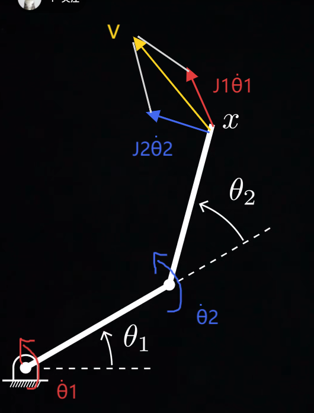
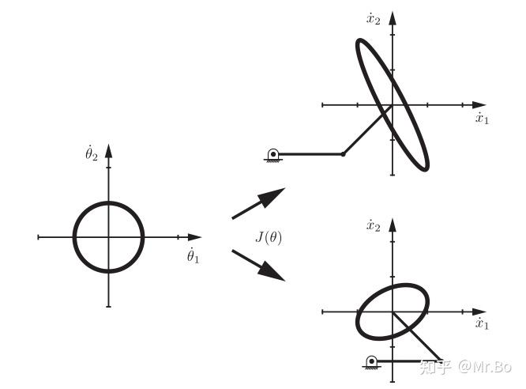
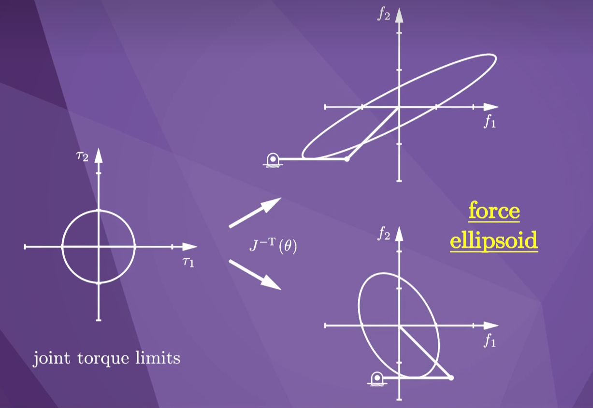
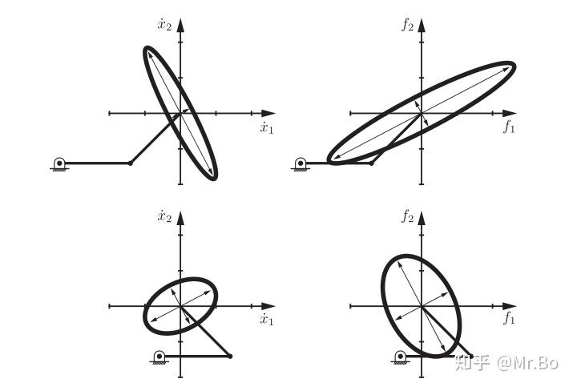

### 【1】末端速度（运动旋量$V$）与关节速度（角速度$\dot{\theta}$）雅可比矩阵映射
第四章我们知道了在知道关节角度位置的情况下求出末端的位姿$T$的方法，这次我们把目光放在知道关节速度（角速度$\dot{\theta}$）的情况下求出末端速度（运动旋量$V$）的方法。

$$\color{#fb8b05}V=J(\theta)\dot{\theta}=J_1(\theta)\dot{\theta}_1+J_2(\theta)\dot{\theta}_2$$先来解释一下这个式子：其实是*每个关节速度对末端速度的贡献之和*，每个*雅可比矩阵其实就是关节速度对末端速度的一个映射方式*

然后讲一下公式里的每个元素的意义：
	$V$：机器人末端执行器的运动旋量（整体速度），详见[[3.5 运动旋量]]
	$\dot{\theta}$：每个关节的角速度
	$J_1，J_2$：关节1和关节2速度对于整体速度的映射矩阵。
	$J$:把每个关节的贡献$J_i(\theta)$按列排列打包起来起来，就是整个雅可比矩阵：$$J(\theta)=\begin{bmatrix}J_1(\theta)&J_2(\theta)&\cdots&J_n(\theta)\end{bmatrix}$$对于$J$的“映射”功能，详细见下一章的内容[[5.2 求空间雅可比矩阵和物体雅可比矩阵]]。
	对于关节角速度来说，按行排列打包起来：$$\dot{\theta}=\begin{bmatrix}\dot{\theta}_1\\\dot{\theta}_2\\\vdots\\\dot{\theta}_n\end{bmatrix}$$

- 具体推导过程：
	与[[2.4 位姿约束和速度约束]]中其实类似，详细的过程可以看一下那章。
	那章的先讲了整体的位姿约束，然后把
	位姿对时间求导=$J(\theta)$雅可比矩阵×角速度$\dot{\theta}$
	本章也是类似的，位姿对时间的求导其实就是整体的速度，因此
	整体速度=雅可比矩阵×角速度

需要注意的是：**雅可比矩阵$J$是一个跟当前关节角度$\theta$有关的东西，换句话说整体的机器人的位姿不同（每个关节角度不一样）的情况下这个雅可比矩阵是不一样的！**

### 【2】奇点：
定义：*当$J_1(\theta)\text{ 和 }J_2(\theta)\text{ 共线}$的时候，此时机器人在某些方向上无法产生速度（自由度降低），此刻这种情况称为奇点。*

先来说一下$J_1(\theta)\text{ 和 }J_2(\theta)\text{ 共线}$的前提条件：
- 在数学上，即$J(\theta)\text{ 变成奇异矩阵}$，奇异矩阵就是某几列之间存在线性关系（例如A列是B列的几倍这种），例如：$J= \begin{bmatrix} 1 & 2 \\ 2 & 4 \end{bmatrix}$
- 物理上，多个关节对末端的速度影响方向相同，也就是$J_1\theta_1$和$J_2\theta_2$的方向相同时。

机器人在某些方向上无法产生速度（自由度降低）：
- 这个我们用一个例子来看看。

我们的手臂是一个$2R$的机械臂，两个旋转关节，当前平举的时候，整个手臂是水平于地面的，此时针对末端也就是我们的手，无论是第一个关节-肩关节转动，还是第二个关节-肘关节转动，或是他俩一起转动，都会发现在那个瞬间，手可能的速度方向都只有垂直上下。而在水平方向上的速度可能性缺失了。

*用例子记最好*👆

- 奇点进阶理解：
$J$的尺寸是自由度×关节数。
对于“*秩*”，定义为矩阵中线性无关的行or列，其实就是代表矩阵最多能表达多少个独立方向。
而对于$J$来说，秩一定小于等于min（自由度，关节数），即自由度和关节数中的最小值。
而机器人能正常运动的情况是满秩的，也就是秩=min（自由度，关节数）的时候。
而只要当前的秩<min（自由度，关节数），就说明其处于奇点！失去部分方向的自由度。

### 【3】可操作椭球：
将各关节速度的集合在坐标系中表示为一个圆形或球体

通过不同机器人位形下不同的雅可比矩阵映射，可以得到不同的末端速度椭圆，注意不同位形下的映射不一样！

*这个椭圆称为“可操作椭球”（显示的速度包括了大小和方向！），其代表了末端速度的可达范围和灵活性*，比如在上图上面那个椭圆里，显示了机器人可以快速地向左上方运动，但只能缓慢地向右上方移动。

*当奇点的时候，这个可操作圆就变成了一条线段*，代表了末端此时可移动方向的缺失，所以可操作圆越圆，说明机器人此刻离奇点越远，反之就是离奇点越近。

- *可操作椭球进阶！关于具体数据和画法*：
![[5 第五章/image5/10.png]]
*记$A=JJ^T$,*(这里的$J$根据你想画出来的椭球所代表的速度的参考系为谁，你就用空间雅可比矩阵或者物体雅可比矩阵)

其中$A$矩阵的特征向量为：$v_{i}$且特征值为$\lambda_{i}$（注意这里的特征向量和特征值也是列向量）

*则椭球主轴的方向就为$v_{i}$
这个方向上的半轴长度就为$\sqrt{\lambda}_{i}$*

因此可以有几个度量可操作椭球离奇点还有多远的值：

1，椭球体的长轴与短轴之比：$$\mu_1(A)=\frac{\sqrt{\lambda_{\max}(A)}}{\sqrt{\lambda_{\min}(A)}}=\sqrt{\frac{\lambda_{\max}(A)}{\lambda_{\min}(A)}}\geq1$$这个值的下限是1，其越接近1，那么椭球将越接近于球体，即意味着机器人在任何方向上都同样容易移动。反之，当机器人接近于奇点时，这个比值将接近无限大。

2，第一个指标的平方，称为矩阵$A$的条件数，越小越好：$$\mu_2(A)=\frac{\lambda_{\max}(A)}{\lambda_{\min}(A)}\geq1$$
3，$A$的特征值乘积的平方根，一定程度上代表了可操作椭球的体积，越大越好：$$\mu_3(A)=\sqrt{\lambda_1\lambda_2\cdots}=\sqrt{\det(A)}$$

一般来说我们通常把$J$按照行上下分成角速度雅可比矩阵$J_{\omega}$和线速度雅可比矩阵$J_{v}$：$$J(\theta)=
\begin{bmatrix}
J_{\omega}(\theta) \\
J_{v}(\theta)
\end{bmatrix}$$这样角速度雅可比矩阵$J_{\omega}$就可以生成角速度可操作椭球和力矩椭球。
而线速度雅可比矩阵$J_{v}$就可以生成线速度可操作椭球和线性力椭球。

>这里解释一下特征向量和特征值：
>	特征向量就是被矩阵“作用”之后，方向不变的向量
>	特征值就是这个向量被“拉长或压缩了多少倍”
>	具体求法如下：
>	对于任意一个矩阵$A$,我们要找向量$\vec{v}$和数$\lambda$,满足：$$A\vec{v}=\lambda\vec{v}$$这个公式可以变形为：$$(A-\lambda I)\vec{v}=0$$其中$I$是单位矩阵。
>	举个例子取一个简单的矩阵$A= \begin{bmatrix} 2 & 1 \\ 1 & 2 \end{bmatrix}$我们先求:$$\det(A-\lambda I)=0$$代进去:$$\begin{vmatrix}2-\lambda & 1 \\1 & 2-\lambda\end{vmatrix}=0$$行列式展开:$$(2-\lambda)^2-1=0 \Rightarrow \lambda^2-4\lambda+3=0$$解这个方程:$$\lambda_1=3, \quad \lambda_2=1$$对于$\lambda=3$：
>	代入$(A-3I)\vec{v}=0$：$$\begin{bmatrix}-1 & 1 \\1 & -1\end{bmatrix}\begin{bmatrix}
x \\
y
\end{bmatrix}=0$$解这个线性方程得到$x=y$所以一个特征向量就是：$$\vec{v}_1=\begin{bmatrix}1 \\1\end{bmatrix}$$类似地，求出另一个特征向量为：$$\vec{v}_2=\begin{bmatrix}1 \\-1\end{bmatrix}$$

### 【4】力旋量$\mathcal{F}$与关节扭矩$\tau$的雅可比矩阵映射

其实就是*每个关节扭矩与末端产生/所受力的关系*
类比上面整体速度和关节速度的式子。
这里用力旋量而不用力就是把旋转的信息打包进来，或者这么说，用力方便理解，但是力旋量才是最终的东西
$$\color{#fb8b05}\mathcal{F}=(J(\theta)^T)^{-1}\tau$$$$\color{#fb8b05}\tau=J(\theta)^T\mathcal{F}$$
>注意：这里的 $\tau$ 就是一个 各个关节扭矩组成的向量$$\tau=
\begin{bmatrix}
\tau_1 \\
\tau_2 \\
\vdots \\
\tau_n
\end{bmatrix}$$

>这里的下标是代表着参考系的意思，所针对的都是针对“末端”！
>例如施加的力是在末端坐标系中表示的，那就是$\tau=J_b^T(\theta)\mathcal{F}_b$
>如果施加的力是在空间坐标系中表示的，那就是$\tau=J_s^T(\theta)\mathcal{F}_s$

- 例子理解：
	![[5 第五章/image5/9.png]]
	如图这种，正常我们想要控制机械臂末端沿着一个固定的轨迹走，那需要的关节扭矩为$\tau_{motion}$。但是如果遇到一个干扰的力旋量$\mathcal{-F_b}$，那我们就需要产生一个对立的力旋量来平衡它，通过关节的扭矩来产生，这个扭矩称为$\tau$

- 推导过程：
	下面的力旋量先拆解用力代表，方便理解
	力×速度=功率=扭矩×角速度
	扭矩其实就是力矩，其特指指绕着轴产生的“扭转”的力矩，然后*扭矩其实就是旋转运动中的“力”*，因此旋转运动中的速度就是角速度，因此扭矩×角速度=功率。$$fV=\tau\dot{\theta}$$对于任意关节角速度，都有$V=J(\theta)\dot{\theta}$ ,那么这样就有：$$fJ(\theta)\dot{\theta}=\tau\dot{\theta}$$解出：$$J(\theta)^Tf=\tau $$

### 【5】力椭球
与可操作椭球类似，关节的力矩也可以在坐标系内视为圆形或球体
也能通过雅可比矩阵的转置逆来映射到末端执行器上，称为力椭球

- *力椭球进阶！*：
细节见上面可操作椭球进阶，改变的就是$$A=(JJ^\mathrm{T})^{-1}$$

### 【6】可操作椭球和力椭球之间的关系

- 可操作椭球和力椭球的主轴（长轴和短轴或者说成对角线轴）朝向是一致的

- 可操作椭球和力椭球的主轴（长轴和短轴或者说成对角线轴）长度对应的倒数

例如：
可操作椭球的半轴长度为 $\sigma_1$，$\sigma_2$
力椭球的半轴长度则为 $\frac{1}{\sigma_1}$，$\frac{1}{\sigma_2}$

*在难以移动的方向很容易施加力，在易于移动的方向上很难施加力。*

这句话的理解可以用一个例子来看👇：
依旧是手臂水平伸直前平举，此刻也是一个奇点，此时可操作圆变成一条线，而我此时手的速度方向只有垂直上下，也就是说比如把坐标系的y轴定义为垂直上下的方向，那么我的可操作圆在此刻就是一条于y轴重合的线段。而力椭圆此刻应该是一个于x轴近乎重合（在 x 轴方向上无限长，在 y 轴方向上非常短甚至为 0）的线段，这时候比如说前平举一个哑铃很困难，这就代表了在x轴方向，也就是沿着我手臂的水平方向我可以承受很大的力，但是在y轴方向我所承受的力就困难，因为此刻y轴方向的力椭圆分量很小很小近乎于0。
此刻垂直方向就是易于移动的方向，但是垂直方向施加力就很困难。
而水平方向是难以移动的方向，但是水平方向我可以承受很大的力。
