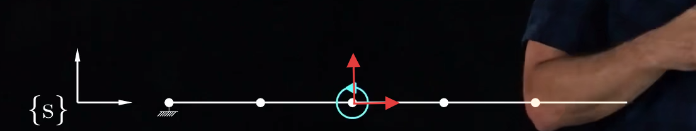
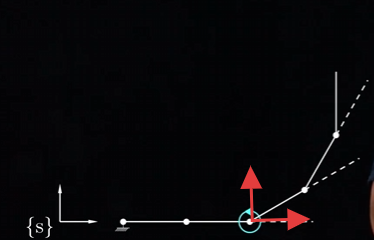
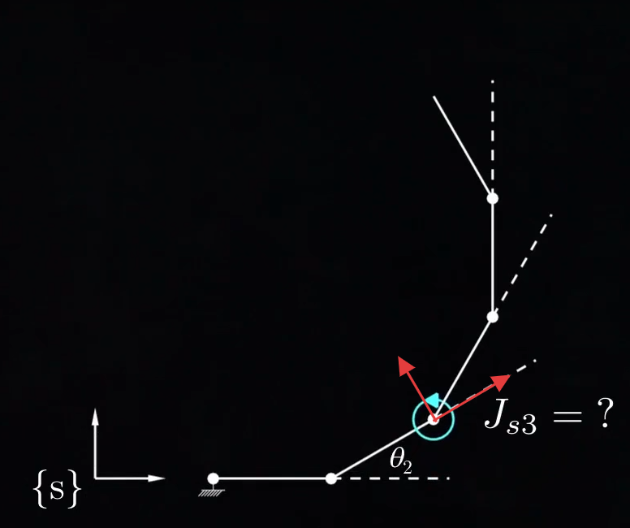

本章内容主要是讲怎么求雅可比矩阵的。
### 【1】空间雅可比矩阵
- 由上章[[5.1 运动旋量or力旋量的雅可比矩阵映射（引入）]]可知：$$\mathcal{V}_s=J_s(\theta)\dot{\theta}$$$$\begin{aligned}
J_{s}(\theta) & =[J_{s1}J_{s2}(\theta)\cdots J_{sn}(\theta)]\in\mathbb{R}^{6\times n}\end{aligned}$$
- 空间雅可比矩阵的核心公式：
	 $$\color{#fb8b05}\begin{aligned}J_{si}(\theta) & =[\mathrm{Ad}_{T_{0→i-1}}]\end{aligned}S_i$$              *该关节与相对系之间的所有关节（不包括自己）*
       结合[[4.1 正运动学]]的公式，详细拆分如下：
	$$J_{s1}=S_1$$$$\color{#fb8b05}\begin{aligned}J_{si}(\theta) & =[\mathrm{Ad}_{e^{[\mathcal{S}_1]\theta_1}...e^{[\mathcal{S}_{i-1}]\theta_{i-1}}}]\mathcal{S}_i\mathrm{~for~}i=2,\ldots,n. \end{aligned}$$$$\color{#fb8b05}\mathcal{V}_{s}=\underbrace{\mathcal{S}_{1}}_{J_{s1}}\dot{\theta}_{1}+\underbrace{\mathrm{Ad}_{e^{[\mathcal{S}_{1}]\theta_{1}}}\left(\mathcal{S}_{2}\right)}_{J_{s2}}\dot{\theta}_{2}+\underbrace{\mathrm{Ad}_{e^{[\mathcal{S}_{1}]\theta_{1}}e^{[\mathcal{S}_{2}]\theta_{2}}}\left(\mathcal{S}_{3}\right)}_{J_{s3}}\dot{\theta}_{3}+....$$

- 理解一下：
我们在引入里面[[5.1 运动旋量or力旋量的雅可比矩阵映射（引入）]]已经提到雅可比矩阵就是关节速度对末端速度的一个映射方式。本章更详细一点，*雅可比矩阵$J(\theta)$中的每一个列向量（比如：$J_{s1}(\theta)...$）就是代表该关节对于末端速度（运动旋量$V$）的映射方法*

这句话中关于“映射”可以这么理解！每个关节的正常运动速度$\mathcal{V}=\mathcal{S}\dot{\theta}$（详见[[3.6 单位螺旋轴]]），这代表了关节自身为参考点处的速度。但机器人是一个串联结构，关节动了之后整条链都会受影响，即关节$i$的速度会沿着杆向后续传播，而这个传播并不是完全一样的$V$传播，因为半径$r$是考虑参考点相对于旋转点的距离，所以线速度$v$会改变，即$V$在传播的过程中也会改变。
所以不能简单直接用$\mathcal{S}\dot{\theta}$直接表示末端的速度，必须改一下映射的关系，也就是改一下$S$。具体的该法就是$J=[\mathrm{Ad}_{T}]S$，这个是$S$参考系转换的知识详见[[3.6 单位螺旋轴]]。*通过$J$来正确映射到末端。*
而这个$[\mathrm{Ad}_{T}]$是一个转换参考系常用的伴随矩阵，核心在这个$T$上。
*对于$T$的定义是$T_{0→i-1}$，具体意思就是考虑本关节和${s}$系之间的所有其它关节（不包括自己）。*
这个可以理解为该机械臂全关节角度为0时，比如说$5R$的机械臂，对于关节3来说，旋转哪个其它关节会改变关节点坐标系与相对定系or相对动系的坐姿。

当旋转关节3或4或5时，并不会改变关节3原点的坐标系与{s}坐标系相对的坐姿。

而当旋转关节1或2时，可以发现关节3原点的坐标系相对于{s}坐标系的坐姿变化了。所以对于关节3的$S$来说，需要$Ad$上$T1$和$T2$也就是$T_{02}$，即$Ad_{e^{[\mathcal{S}_1]\theta_1}e^{[\mathcal{S}_2]\theta_2}}$

这么一来对于上面的公式就讲得通了，第一个关节为什么直接写成$S_1$，因为它和${s}$之间没有其它关节了，即$i-1=0$，此时$Ad$就是单位矩阵，对于第一个关节来说$J_{s1}=S_1$

如果是并联机构，也就是多关节运动互不影响，那$J_i=S_i$

### 【2】物体雅可比矩阵

与空间雅可比矩阵类似的$$\mathcal{V}_b=J_b(\theta)\dot{\theta}$$$$\begin{aligned}
J_{b}(\theta) & =[J_{b1}(\theta)\cdots J_{bn-1}(\theta)J_{bn}(\theta)]
\end{aligned}$$
	- 物体雅可比矩阵的核心公式为：$$\color{#fb8b05}\begin{aligned}J_{si}(\theta) & =[\mathrm{Ad}_{T_{n→i+1}}]\end{aligned}S_i$$*在这里$T$按物体坐标系的那种指数分法，也就是$\mathcal{B}$，且加上逆也就是负号！*$$J_{bn}=\mathcal{B}_n$$这里的$\mathcal{B}$详见[[4.1 正运动学]]$$\color{#fb8b05}J_{bi}(\theta)=[\mathrm{Ad}_{e^{-[\mathcal{B}_n]\theta_n}....e^{-[\mathcal{B}_{i+1}]\theta_{i+1}}}]\mathcal{B}_i$$$$\color{#fb8b05}\mathcal{V}_{b}=\underbrace{\mathcal{B}_{n}}_{J_{bn}}\dot{\theta}_{n}+\underbrace{\mathrm{Ad}_{e^{-[B_{n}]\theta_{n}}}\left(\mathcal{B}_{n-1}\right)}_{J_{b,n-1}}\dot{\theta}_{n-1}+\cdots+\underbrace{\mathrm{Ad}_{e^{-[B_{n}]\theta_{n}\cdots e^{-[B_{2}]\theta_{2}}}}\left(\mathcal{B}_{1}\right)}_{J_{b1}}\dot{\theta}_{1}.$$注意这里的负号代表着逆矩阵。

### 【3】空间雅可比矩阵和物体雅可比矩阵的区别于联系

- 区别：最后推导出的运动旋量的参考系不同，一个是物体运动旋量，一个是空间运动旋量，详见[[3.5 运动旋量]]

- 联系：我们可以切换不同的参考系来表达同一个旋量（这里描述的都是末端的运动速度，只是参考系不同）。因此可以将$J_s$和$J_b$相互转换。
$$\color{#fb8b05}J_b(\theta)=[\mathrm{Ad}_{T_{bs}}]J_s(\theta)$$
$$\color{#fb8b05}J_s(\theta)=[\mathrm{Ad}_{T_{sb}}]J_b(\theta)$$依旧是下标相消的转换参考系方法