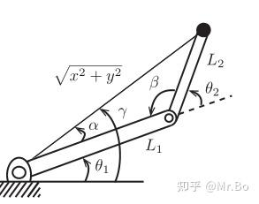
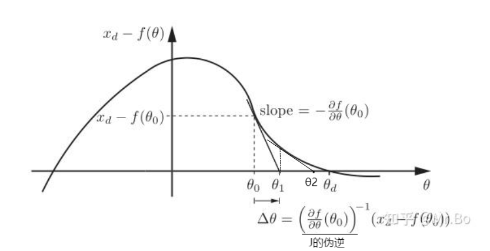
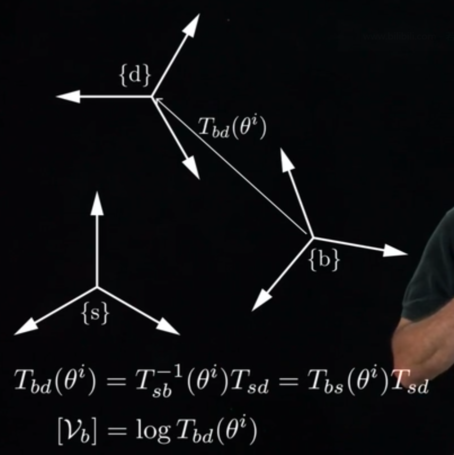

之前我们研究过[[4.1 正运动学]]，它是代表已知关节位形$\theta$→求解末端的姿态
这章我们研究逆运动学，其代表**给定所需的末端位形，求解该位形下各关节的位形$\theta$**

### 【1】可解性

![[6 第六章/image6/1.png]]

逆运动学存在无解，唯一解，多重解的情况。

因此我们需要先观察该机器人的工作空间，详见[[2.5 任务空间与工作空间]]。如图中$2R$这个机械臂的例子，它的工作空间就是一个圆.环，外圆的半径为$L_1+L_2$，内圆的半径为$L_1+L_2$（假设$L_1>L_2$）。

- 如果我们将末端位置$(x,y)$定在工作空间之外，则逆运动学无解

- 如果我们将末端位置$(x,y)$定在工作空间的边界上，则有唯一解，例如这里在内边界上时$\theta_2=\pi$，在外边界上时，$\theta_2=0$

- 如果我们将末端位置$(x,y)$定在工作空间的内部，则有两解（注意多重解可能不止只有两解，可能有更多解）

我们一般计算和考虑的情况都是正常的多重解情况
这时候还要考虑最优解的问题，根据不同的问题可以设置不同的衡量标准，例如上图中，末端处于同一点的时候，机械臂有两种可能的姿态。而如果我们希望机械臂末端移动到这个末端点，此时我们的机械臂将会趋近这两种解的姿态，如果我们机械臂一开始的姿态更贴近下面那种解，那也就是说行程更短，所以下面那种解就是最优解。

### 【2】大概了解

关于逆运动学我们主要分为两种解法，*解析解法*和*数值解法*。
在这里先笼统地说一下关于这两种的特点。

- 解析解法（几何解法）：
	通过几何图形的方法推导出严格公式来求解
	优点：精度高，能得到所有解
	缺点：通用性差，没有通用的公式，仅针对特定结构可解，例如满足$Pieper$准则。因为是几何求解，所有因为装配的精度导致解的不准确。
		这里提一嘴$Pieper$准则：如果机器人满足两个条件中的一个，则满足$Pieper$准则
			1：三个相邻关节轴相交于同一点。
			2：三个相邻关节周相互平行

- 数值解法：
	需要估计解的初值，然后逐步地将初始值向正确解逼近
	优点：适用性广，有一个通用的思路和公式
	缺点：精度没有那么高（因为最终还是近似的），

最终选择哪种解法还是得综合多方面的考虑因素来决定。👇

这里对解析法只做一个大概的例子了解，因为其依靠几何推导，所以构型一样的机械臂的解析解是一样的，所以一个构型的机械臂的解析法逆解公式，去网上找个推导的论文，直接用结论就可以了。

我们主要是对数值求法进行讲解，因为其需要选定一个大概的初始值，所以我们可以先计算解析解，然后用数值法来一步步趋近，来改善求解精度。即解析法和数值法结合来做也是可以的。

### 【3】解析法（几何法）

我们对解析法只做一个大概的例子了解，因为其依靠几何推导，所以每个推导的思路啊公式啊都不太一样。

我们用平面$2R$机器人的逆运动学解析法来做例子。

>这里引入一个概念$atan2(y,x)$：
>	画原点到这个点的一个线，然后看x轴正半轴到这条线的角度，逆时针为正，顺时针为负。即$atan2(y,x)$的取值范围为$(1-\pi,\pi]$
>	(1,1):第一象限，角度 45°
>	(-1,1):第二象限，角度 135°
>	(-1,-1):第三象限，角度 -135°
>	(1,-1):第四象限，角度 -45°

复习一下余弦定理：$$c^2=a^2+b^2-2ab\cos C$$其中$a$,$b$和$c$分别表示三角形的3个边长，$C$为与长为$c$的边所相对的那个角度

看图可知，由余弦定理得：$$\beta=\cos^{-1}\left(\frac{L_1^2+L_2^2-x^2-y^2}{2L_1L_2}\right)$$同样，由余弦定理得：$$\alpha=\cos^{-1}\left(\frac{x^2+y^2+L_1^2-L_2^2}{2L_1\sqrt{x^2+y^2}}\right)$$再通过$atan2$求出$\gamma$

这样第一种解则为（right解）：$$\theta_1=\gamma-\alpha,\quad\theta_2=\pi-\beta$$第二种解（left解）：$$\theta_1=\gamma+\alpha,\quad\theta_2=\beta-\pi$$

### 【4】数值解法

其核心的思路是通过*牛顿-拉夫森数值算法*来逼近最终解。
（这里先用单纯数学上的概念讲一遍，然后再扩展到空间矩阵中）

定义：
（1）初始化：已知$x_d$（期望的末端位形），选定一个初始值$\theta_0$，其会在$x_d-f(\theta)$关于$\theta$的函数图像上有一个值为$f(\theta)$
（2）计算与期望的误差$e=x_d-f(\theta^i)$，如果$\|e\|<\epsilon$（这个$\epsilon$是一个非常小非常小的值），那么此刻$\theta^i$就是一个解。反之则执行以下步骤
（3）那么我们需要更新$\theta$，$\theta^{i+1}=\theta^i+J^\dagger(\theta^i)e$（即把伪逆$J$乘以误差$e$加到$\theta$上），然后$i+1$，重复先前的步骤。（有点像继续循环的感觉）

看图理解更快，整个函数曲线就是一个目标位置$x_d$与目前位置$f(\theta)$的相差值的函数$x_d-f(\theta)$，看曲线可知，这个机器人该位置有两个解。

我们先取一个初始值$\theta_0$，得到一个$x_d-f(\theta)$的点。然后做这个点在这个函数上的斜率切线，交x轴于一个新的点$\theta_1$。

这个动作的意思其实就是整个这个算法的思路核心：*通过不断取点值做斜率切线与x轴交点的方法一步步趋近目标点*

然后检查这个$\theta_1$的函数值$f(\theta_1)$是否足够贴近$x_d$，我们这里统一记一个误差值来记录这一信息：$e=x_d-f(\theta^i)$，如果这个误差值足够足够小，也就说明此时的点$\theta_i$与我们的目标点$\theta_d$近似了，那么我们就算求完数值解了。

如果误差不够小，那么我们就得重复上面的步骤，根据误差$e$把$\theta$更新。换句话说有点像递归。把上一步做斜线的$\theta_i$变成$\theta_i+1$。这样不断做斜线直到误差足够小趋近目标点。

>注意：初始值如果在高点的左边，结果容易在另一边收敛，也就是求出另一个解。
>如果初始值在高点附近，结果荣耀导致过大的初值$\left|\Delta\theta\right|$，最终无法收敛。
>高点的意思就是函数值的平坦端。
>![[6 第六章/image6/4.png]]

**伪逆**$J^\dagger$👇
>关于这个伪逆$J$，也就是$J^\dagger$。
>引入它的意思主要是为了当$J$不可逆的时候，也能使用这个公式正常计算。
>
>伪逆雅可比矩阵$J^\dagger$的定义：
>伪逆雅可比矩阵$J^\dagger$是雅可比矩阵$J\in\mathbb{R}^{m\times n}$的广义解，
>当$m\geq n$时，也就是$J$为瘦高型：$$J^+=(J^TJ)^{-1}J^T$$当$m<n$时，也就是$J$为矮胖型：$$J^+=J^T(JJ^T)^{-1}$$
>
>使用伪逆$J^\dagger$还可以在特殊情况时候最优化计算结果。例如：
>方程无精确解的时候，最小化与目标的偏差。
>当雅可比矩阵不满秩时（奇点），自动选择绝对值最小的值。

现在我们推广到空间矩阵上，我们刚刚说的末端目标位置为$x_d$但实际应该是类似$T_{sd}$这种，代表了空间有三个系，定系{s}，现在的系{b}，目标的系{d}。
而坐标版本中的误差我们用$e$，其实它可以理解为一种速度，我们看那个误差公式$e=x_d-f(\theta^i)$，即如果末端执行器以$e$速度运动单位时间，那么它将从当前位形$f(\theta^i)$移动到目标位形$x_d$。所以这里用运动旋量代替误差$[\mathcal{V}_b]=\log\left(T_{sb}^{-1}(\theta^i)T_{sd}\right)$

具体$[\mathcal{V}_b]$的公式表达推导如图，第二步是矩阵对数，给出$T$，求$S$和$\theta$，再$\mathcal{V}=\mathcal{S}\dot{\theta}$求出$V$。详见[[3.7 刚体运动的指数坐标]]。

**因此逆运动学的真正算法应该如下👇：
（1）初始化：已知$\color{#fb8b05}T_{sd}$（期望的末端位形），选定一个初始值$\color{#fb8b05}\theta_0$
（2）计算与期望的误差$\color{#fb8b05}[\mathcal{V}_b]=\log\left(T_{sb}^{-1}(\theta^i)T_{sd}\right)$，如果运动旋量的旋转分量$\color{#fb8b05}\|\omega_b\|<\epsilon$和直线分量$\color{#fb8b05}\|v_b\|<\epsilon$（这个$\color{#fb8b05}\epsilon$是一个非常小非常小的值），那么此刻$\color{#fb8b05}\theta^i$就是一个解。反之则执行以下步骤
（3）那么我们需要更新$\color{#fb8b05}\theta$，$\color{#fb8b05}\theta^{i+1}=\theta^i+J^\dagger(\theta^i)\mathcal{V_b}$，然后$\color{#fb8b05}i+1$，重复先前的步骤。**

### 【5】逆向速度运动学

某些情况下，我们只需找到末端运动旋量所需的关节速度即可（即末端需要达到指定的瞬时速度$V_d$，求此时关节的速度）

$$\color{#fb8b05}\dot{\theta}=J^{\dagger}(\theta)\mathcal{V}_{d}$$

注意运动旋量$V_d$和伪逆雅可比矩阵$J^{\dagger}(\theta)$的参考系相同，取决于是空间运动旋量还是物体运动旋量。这里的$V_d$可以直接给出，或者通过$T_{sd}^{-1}(t)\dot{T}_{sd}(t)$（物体坐标系下的速度）或$\dot{T}_{sd}(t)T_{sd}^{-1}(t)$（空间坐标系下的速度），祥见[[3.5 运动旋量]].但是我们一般选择物体运动旋量来计算，因为误差会一步步积累，选择物体上的视角误差不会那么大。