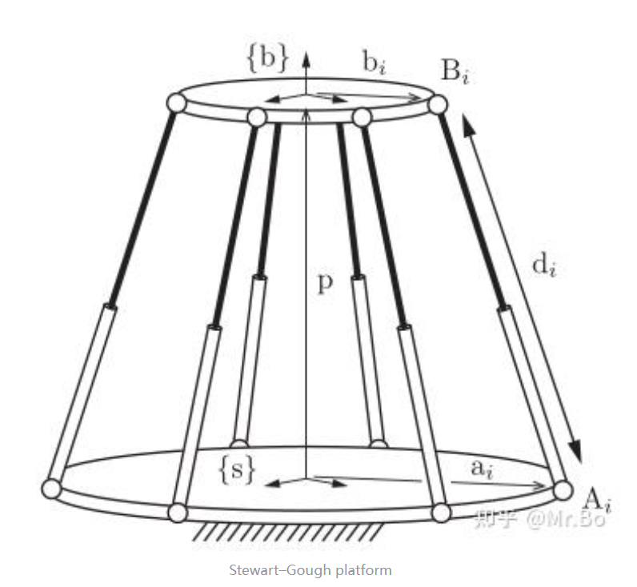
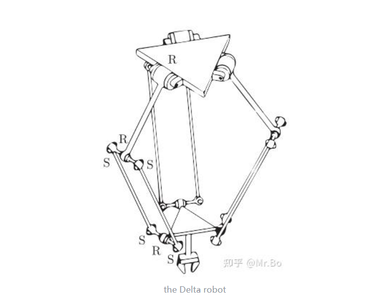
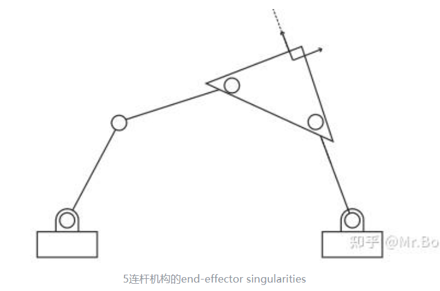

### 【1】定义
对于任何包含一个环或者多个环的运动链就称为闭链
- 我们主要讨论的是闭链中的一类——*并联机构*。
如图就是典型的并联机构的例子

其特点是两个平台，一个固定的静止平台，一个移动的平台，由多条腿连接，对于每条腿来说，通常是开链，当然也可以是闭链。

- 并联机器人的一些特点
1，许多关节都是无驱动的被动关节，只有一些关节是有驱动的驱动关节。

2，工作空间相对于开链机器人较小

3，负载能力和刚度相对于开链机器人较强（末端的力可以分散到每个腿上）

4，相比开链，正运动学比较棘手，而逆运动学较为简单。

### 【2】闭链逆运动学

- （1）*对于特殊的一些并联机器人，可以通过几何机构构建简单的公式来直接推出逆运动学*
	![[Pasted image 20250703100709.png]]
	对于特殊的$Stewart–Gough$平台机器人。
	一共由6个串联的腿来连接底下的固定平台和上面的移动平台。每条腿上球铰为被动副，移动副为驱动副。
	注意图中的所有标注都为向量
	可以观察几何结构得出：$$\mathrm{d}_i=\mathrm{p}+\mathrm{b}_i-\mathrm{a}_i,\quad i=1,\ldots,6.$$而要注意这里的$b_i$是相对于动系${s}$来描述的，所以要转换到定系来描述，通过两个坐标系之间的简单旋转矩阵。$$\mathrm{d}_i=\mathrm{p}+R\mathrm{b}_i-\mathrm{a}_i,\quad i=1,\ldots,6.$$
	这里的$d_i$是向量，要求出腿的长度要求模长。第$i$条腿的长度用$s_i$表示。$$s_i^2=\|d_i\|^2=d_i^Td_i=(p+Rb_i-a_i)^\mathrm{T}(p+Rb_i-a_i)$$这里这个公式是向量长度平方的基本定义，不再赘述。
	
	这样就完成了即给出末端姿态$(p,R)$，可以求出每条腿的长度$s_i$（即驱动关节的角度）

- （2）*对于一般的并联机构，整体的逆运动学相当于拆解成每条腿的逆运动学，然后通过闭环约束来将它们耦合在一起。*
	![[Pasted image 20250703102357.png]]
	固定平台和移动平台由三条开链腿连接
	那么移动平台就可以用$T_{sb}$ 来描述
	记三条腿的正运动学分别为$T_1(\theta),\theta\in R^m$ ,$T_2(\phi),\phi\in R^n$ ,$T_3(\psi),\psi\in R^p$ 
	那么loop-closure就可以写作：$T_{sb}=T_1(\theta)=T_2(\phi)=T_3(\psi)$
	那么就相当于知道了每天腿的末端姿态，分别求每条腿上的逆运动学，然后再通过一些比如几何的约束列出闭环约束的方程，将每条腿耦合在一起。

### 【3】闭链正运动学

闭链的正运动学通常允许存在多个解
例如下图中$3-RPR$机构各移动关节的伸直长度相同时，正运动学的两个解
![[7 第七章/image7/4.png]]

我们主要讨论的是正向运动学中的速度旋量部分。
![[Pasted image 20250703102357.png]]
在开链机器人中，正向的运动旋量是：$V=J(\theta)\dot{\theta}$
而闭链机器人中最重要的就是存在被动关节。因此闭链并联机器人的正向运动学可以写成：$$\color{#fb8b05}V_s=J_a(q)\dot{q}_a$$$$\color{#fb8b05}\left.J_a(q)=J_1(q_1,\ldots,q_5)\left[
\begin{array}
{c}e_1^\mathrm{T} \\
g_2(q)^\mathrm{T} \\
g_3(q)^\mathrm{T} \\
g_4(q)^\mathrm{T} \\
g_5(q)^\mathrm{T}
\end{array}\right.\right]$$
这里$\dot{q}_a$为驱动关节的速度$\dot{q_a}= \begin{bmatrix} \dot\theta_1 \\ \dot\phi_1 \\ \dot\psi_1 \end{bmatrix}$

$J_{a}$ 是开链雅可比 $J_1$ 与被动关节映射矩阵的乘积

$J_1(q_1,\ldots,q_5)$是其中一条腿上的雅可比矩阵$J$（选哪条腿都一样）

$e_1^\mathrm{T}$是驱动关节的单位矩阵$I$，有几个驱动关节就是几×几的单位矩阵

$g_i(q)^T$实际上是 $-H_p^{-1}H_a$矩阵的行向量,代表了该关节与驱动关节之间的关系。
	$\dot{q}_p=-H_p^{-1}H_a\dot{q}_a$ 这是代表被动关节速度可以由驱动关节速度求出
	由$\begin{bmatrix} H_a(q) & H_p(q) \end{bmatrix} \begin{bmatrix} \dot{q}_a \\ \dot{q}_p \end{bmatrix}=0$这个公式推出

跟开链机构一样，作用于末端的力旋量与力矩的相关公式也可以写成$\tau=J_a^T\mathcal{F}$

### 【4】闭链的奇异情况

- 1，位形空间奇异：
![[Pasted image 20250703110841.png]]
右图为这个4连杆机构的C空间，可以发现曲线存在交点，这些交点称为分岔点。在这些分岔点的时候，运动的解法变得不唯一，称为位形空间奇异。

或者可以通过$\begin{bmatrix} H_a(q) & H_p(q) \end{bmatrix} \begin{bmatrix} \dot{q}_a \\ \dot{q}_p \end{bmatrix}=0$判断，
如果$H(q)$的秩小于$p$（被动关节的数量），所有可能的驱动关节组合的约束矩阵不满秩。此时系统处于位形空间奇异

位形空间奇异与驱动副的选取无关。

- 2，驱动奇异：
![[Pasted image 20250703111357.png]]
对于图中左侧称为非退化驱动奇异，这种情况下，向外旋转方向相反的两个驱动关节将把机构拉开，向内旋转则会要么会压碎内部的两个连杆，要么导致中心接头不可预测地向上或向下弯曲。（驱动关节不能被独立驱动时——非退化驱动奇异）

对于右侧称为退化驱动奇异，即使当驱动关节锁定在适当的位置，内部的两个连杆依旧可以自由旋转。
（当锁定所有关节不能使机构成为刚性结构时——退化驱动奇异）
（不需要理解具体区分退化和非退化）

可以通过$\begin{bmatrix} H_a(q) & H_p(q) \end{bmatrix} \begin{bmatrix} \dot{q}_a \\ \dot{q}_p \end{bmatrix}=0$判断，
如果$H_p(q)$的秩小于$p$（被动关节的数量），意味着被动关节的约束矩阵不满秩。此时系统处于驱动奇异

驱动奇异取决于驱动副的选取。

- 3，末端奇异：

只关注末端的x-y坐标，处于该位形时，沿虚线的速度是不可能的。

当末端执行器失去一个或多个运动自由度的情况称为末端奇异。

末端奇异取决于平台末端的选择，不取决于驱动副的选取。

