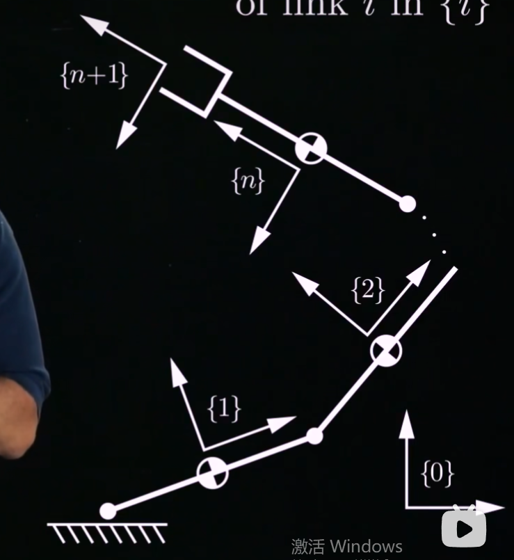

### 【1】牛顿欧拉递归算法，逆动力学：
牛顿欧拉算法的核心思想是**递归**。
以逆动力学举例，给出关节加速度$\ddot{\theta}$→求解力$\tau$

- 1，*首先进行正向遍历，计算每个连杆的运动旋量$V_i$和加速度$\dot{V_i}$*：
速度：$$\color{#fb8b05}\mathcal{V}_i=\mathcal{A}_i\dot{\theta}_i+[\mathrm{Ad}_{T_{i,i-1}}]\mathcal{V}_{i-1}$$即，*连杆$i$的运动旋量=连杆$i-1$的运动旋量（但是要转换到$i$坐标系一下[[3.5 运动旋量]]）+由关节本身速度$\dot{\theta}$所引起的附加运动旋量。（这里的$\mathcal{A}$基本相当于$S$）*

把上式子对时间求导一下整理可得加速度：
$$\color{#fb8b05}\dot{\mathcal{V}}_{i}=\mathcal{A}_{i}\ddot{\theta}_{i}+[\mathrm{Ad}_{T_{i,i-1}}]\dot{\mathcal{V}}_{i-1}+[\mathrm{ad}_{\mathcal{V}_{i}}]\mathcal{A}_{i}\dot{\theta}_{i}$$即，*连杆$i$的加速度是3个分量之和：由关节加速度$\ddot{\theta}$引起的分量+由连杆$i-1$的加速度所引起的分量（转换一下参考系）+速度乘积分量。*

正向遍历后，我们就得到了所有连杆的位形，运动旋量和加速度。

- 2，*接着进行逆向遍历，计算每个连杆所需的关节力和力矩*：
力旋量：$$\color{#fb8b05}\mathcal{F}_i=\mathcal{G}_i\dot{\mathcal{V}}_i-\mathrm{ad}_{\mathcal{V}_i}^\mathrm{T}(\mathcal{G}_i\mathcal{V}_i)+\mathrm{Ad}_{T_{i+1,i}}^\mathrm{T}(\mathcal{F}_{i+1})$$即，*作用在连杆$i$上总的力旋量是由通过关节$i$传递的力旋量（[[8.2 动力学——单刚体动力学]]）+通过关节$i+1$而传递在连杆上的力旋量。*

力矩：$$\color{#fb8b05}\tau_i=\mathcal{F}_i^\mathrm{T}\mathcal{A}_i$$（这里解释一下这个力矩公式是怎么来的，可以理解为把杆的力在关节的螺旋轴上的投影。$\mathcal{F}_i$是是整条连杆上合成下来的力和力矩的组合，是包含很多运动影响的复合。但这里我们只用关注其在关节运动方向上的投影，也就是关节的力矩，关节所提供的力就行。这里转置是方便向量相乘。）
（注意正向遍历的起点是$V_0$也就是基座的运动旋量，然后反向遍历的起点是$\mathcal{F}_{n+1}$这些都是已知条件里给的或是人为设定的）

逆向遍历后，我们就计算出了，在当前关节位置和速度下，提供对应关节加速度所需的所有关节力和力矩。

>推导过程：
>拿上图中n连杆的开链机器人做例子，并对符号和坐标系进行一个定义
>
>在每个连杆$i$的质心处附着一个参考坐标系${i}$。基座坐标系表示为${0}$，末端执行器的坐标系表示为${n+1}$。当机械臂处于初始位置（零位）时，我们将坐标系的初始位姿定义为$M$。$M_{i-1,i}=M_{i-1}^{-1}M_{i}\quad\mathrm{and}\quad M_{i,i-1}=M_{i}^{-1}M_{i-1}$参考系的一个转换。这样$M$就可以作为已知量
>
>关节$i$的螺旋轴在连杆坐标系${i}$中的表示为$\mathcal{A}_i$，而同样的螺旋轴在空间定系${0}$中的表示为$S_i$，二者之间的联系为：$\mathcal{A}_{i}=\mathrm{Ad}_{M_{i}^{-1}}(\mathcal{S}_{i})$，详见[[3.6 单位螺旋轴]]。这样$\mathcal{A}_i$就可以作为已知量。
>
>对于任意的关节$\theta$,定义$T_{i-1,i}(\theta)$为此时坐标系${i}$在${i-1}$中的位形。$T_{i-1,i}(\theta_{i})=M_{i-1,i}e^{[\mathcal{A}_{i}]\theta_{i}}\quad\mathrm{and}\quad T_{i,i-1}(\theta_{i})=e^{-[\mathcal{A}_{i}]\theta_{i}}M_{i,i-1}$，这样位形$T$就可以作为已知量。
>
>有了这些先前处理，就可以开始正式的推导了。
>连杆$i$的运动旋量=连杆$i-1$的运动旋量+由关节本身速度$\dot{\theta}$所引起的附加运动旋量。$\mathcal{V}_i=\mathcal{A}_i\dot{\theta}_i+[\mathrm{Ad}_{T_{i,i-1}}]\mathcal{V}_{i-1}$这个是很基础的概念公式。
>
>然后我们对时间求导$\dot{\mathcal{V}}_i=\mathcal{A}_i\ddot{\theta}_i+[\mathrm{Ad}_{T_{i,i-1}}]\dot{\mathcal{V}}_{i-1}+\frac{d}{dt}\left([\mathrm{Ad}_{T_{i,i-1}}]\right)\mathcal{V}_{i-1}$
>
>为了方便推导,把 }$\mathcal{A}_i$和$T_{i,i-1}$ 写成矩阵形式:
>$T_{i,i-1}= \begin{bmatrix} R_{i,i-1} & p \\ 0 & 1 \end{bmatrix}\quad\mathrm{and}\quad\mathcal{A}_i= \begin{bmatrix} \omega \\ v \end{bmatrix}$
>这样加速度中的第三项可得$\begin{aligned} \frac{d}{dt} & ([\mathrm{Ad}_{T_{i,i-1}}])\mathcal{V}_{i-1} \\ & =\frac{d}{dt} \begin{bmatrix} R_{i,i-1} & & 0 \\ [p]R_{i,i-1} & & R_{i,i-1} \end{bmatrix}\mathcal{V}_{i-1} \\ & = \begin{bmatrix} -[\omega\dot{\theta}_i]R_{i,i-1} & 0 \\ [-[\omega\dot{\theta}_i]p-v\dot{\theta}_i]R_{i,i-1}-[p][\omega\dot{\theta}_i]R_{i,i-1} & -[\omega\dot{\theta}_i]R_{i,i-1} \end{bmatrix}\mathcal{V}_{i-1} \\ & =\underbrace{ \begin{bmatrix} -[\omega\dot{\theta}_i] & 0 \\ -[v\dot{\theta}_i] & -[\omega\dot{\theta}_i] \end{bmatrix}}_{-[\mathrm{ad}_{\mathcal{A}_i\dot{\theta}_i}]}\underbrace{ \begin{bmatrix} R_{i,i-1} & 0 \\ [p]R_{i,i-1} & R_{i,i-1} \end{bmatrix}}_{[\mathrm{Ad}_{T_{i, i-1}}]}\mathcal{V}_{i-1} \\ & =-[\mathrm{ad}_{\mathcal{A}_i\dot{\theta}_i}]\mathcal{V}_i \\ & =[\mathrm{ad}_{\mathcal{V}_i}]\mathcal{A}_i\dot{\theta}_i, \end{aligned}$
>代入回去求出加速度最终的式子：$\dot{\mathcal{V}}_{i}=\mathcal{A}_{i}\ddot{\theta}_{i}+[\mathrm{Ad}_{T_{i,i-1}}]\dot{\mathcal{V}}_{i-1}+[\mathrm{ad}_{\mathcal{V}_{i}}]\mathcal{A}_{i}\dot{\theta}_{i}$
>
>这样正向遍历就结束了，一旦确定了所有连杆从基座向外遍历的所有运动旋量和加速度，就可以通过从末端向内部遍历来计算各关节力矩或力。
>
>$\mathcal{F}_i=\mathcal{G}_i\dot{\mathcal{V}}_i-\mathrm{ad}_{\mathcal{V}_i}^\mathrm{T}(\mathcal{G}_i\mathcal{V}_i)+\mathrm{Ad}_{T_{i+1,i}}^\mathrm{T}(\mathcal{F}_{i+1})$
>作用在连杆$i$上总的力旋量是由通过关节$i$传递的力旋量（[[8.2 动力学——单刚体动力学]]）+通过关节$i+1$而传递在连杆上的力旋量。这也是一个概念性的公式。
>接着就是写出力矩的式子（怎么写的上面有详细讲过）
>$\tau_i=\mathcal{F}_i^\mathrm{T}\mathcal{A}_i$

### 【2】牛顿欧拉封闭形式的方程，逆动力学：
先解释一下这个“封闭形式”，递归法：是一种算法流程，它虽然效率高，但最后得出的只是一个数值结果，不是一个具体的公式形式。
而*这个封闭形式，相当于对”递归算法结果的打包建模“。给出一个完整的数学表达式*。

最终的式子为：$$\color{#fb8b05}\tau=M(\theta)\ddot{\theta}+c(\theta,\dot{\theta})+g(\theta)+J^{\mathrm{T}}(\theta)\mathcal{F}_{\mathrm{tip}}$$式子中其他项为：
$$\color{#fb8b05}\begin{aligned}
M(\theta) & =\quad\mathcal{A}^\mathrm{T}\mathcal{L}^\mathrm{T}(\theta)\mathcal{G}\mathcal{L}(\theta)\mathcal{A}, \\
c(\theta,\dot{\theta}) & =\quad-\mathcal{A}^\mathrm{T}\mathcal{L}^\mathrm{T}(\theta)\left(\mathcal{G}\mathcal{L}(\theta)\right.[\mathrm{ad}_{\mathcal{A}\dot{\theta}}]\mathcal{W}(\theta)+[\mathrm{ad}_{\mathcal{V}}]^\mathrm{T}\mathcal{G})\mathcal{L}(\theta)\mathcal{A}\dot{\theta} \\
g(\theta) & =\quad\mathcal{A}^\mathrm{T}\mathcal{L}^\mathrm{T}(\theta)\mathcal{G}\mathcal{L}(\theta)\dot{\mathcal{V}}_\mathrm{base}.
\end{aligned}$$

1，首先可以发现这个式子跟[[8.1 动力学——拉格朗日公式]]的式子是一样的，就是为了形式的统一性。

2，接着解释一下$\dot{\mathcal{V}}_\mathrm{base}$是基座的加速度。$\mathcal{F}_{\mathrm{tip}}$是末端执行器所受到的外部力旋量。$J^{\mathrm{T}}(\theta)\mathcal{F}_{\mathrm{tip}}$是末端力对对应关节扭矩的影响，详见[[5.1 运动旋量or力旋量的雅可比矩阵映射（引入）]]。是递归的边界条件。

3，接着讲一下这个封装的思路：

这个$\mathcal{W}(\theta)$，$\begin{array} {cccccc}\mathcal{W}(\theta) & = & \begin{bmatrix} 0 & 0 & \cdots & 0 & 0 \\ [\operatorname{Ad}_{T_{21}}] & 0 & \cdots & 0 & 0 \\ 0 & [\operatorname{Ad}_{T_{32}}] & \cdots & 0 & 0 \\ \vdots & \vdots & \ddots & \vdots & \vdots \\ 0 & 0 & \cdots & \begin{bmatrix} \operatorname{Ad}_{T_{n,n-1}} \end{bmatrix} & 0 \end{bmatrix} \end{array}$ （1），其的引入是封装递归思想的第一步：
观察之前递归的速度公式：$\mathcal{V}_i=\mathcal{A}_i\dot{\theta}_i+[\mathrm{Ad}_{T_{i,i-1}}]\mathcal{V}_{i-1}$，每次递归变化最大的就是这个$[\mathrm{Ad}_{T_{i,i-1}}]$因此我们用一个矩阵的方式把所有的$[\mathrm{Ad}_{T_{i,i-1}}]$都封装在一起，变成$\mathcal{W}(\theta)$这样就*通过矩阵封装的方式解决了递归的问题*。
因此第一步封装后式子为：$\begin{aligned} & \mathcal{V} & & =\quad\mathcal{W}(\theta)\mathcal{V}+\mathcal{A}\dot{\theta}+\mathcal{V}_{\mathrm{base}}, \\ & \dot{\mathcal{V}} & & =\quad\mathcal{W}(\theta)\dot{\mathcal{V}}+\mathcal{A}\ddot{\theta}-[\mathrm{ad}_{\mathcal{A}\dot{\theta}}](\mathcal{W}(\theta)\mathcal{V}+\mathcal{V}_{\mathrm{base}})+\dot{\mathcal{V}}_{\mathrm{base}} \\ & \mathcal{F} & & =\quad\mathcal{W}^\mathrm{T}(\theta)\mathcal{F}+\mathcal{G}\dot{\mathcal{V}}-[\mathrm{ad}_{\mathcal{V}}]^\mathrm{T}\mathcal{G}\mathcal{V}+\mathcal{F}_{\mathrm{tip}}, \\ & \tau & & =\quad\mathcal{A}^\mathrm{T}\mathcal{F}. \end{aligned}$

（2），但是这里$\mathcal{V}_{i-1}$还是递归，因此引入$\mathcal{L}(\theta)=(I-\mathcal{W}(\theta))^{-1}$，写作：$\left.\mathcal{L}(\theta)=\left[ \begin{array} {ccccc}I & 0 & 0 & \cdots & 0 \\ [\operatorname{Ad}_{T_{21}}] & I & 0 & \cdots & 0 \\ [\operatorname{Ad}_{T_{31}}] & [\operatorname{Ad}_{T_{32}}] & I & \cdots & 0 \\ \vdots & \vdots & \vdots & \ddots & \vdots \\ [\operatorname{Ad}_{T_{n1}}] & [\operatorname{Ad}_{T_{n2}}] & [\operatorname{Ad}_{T_{n3}}] & \cdots & I \end{array}\right.\right]$
这个引入有什么用呢，上面第一步封装之后式子为$\mathcal{V}\quad=\quad\mathcal{W}(\theta)\mathcal{V}+\mathcal{A}\dot{\theta}+\mathcal{V}_\mathrm{basc}$
将方程改写为：
$$(I-\mathcal{W}(\theta))\mathcal{V}=A\dot{\theta}+\mathcal{V}_\mathrm{basc}$$
两边左乘
$$\mathcal{V}=\mathcal{L}(\theta)(A\dot{\theta}+\mathcal{V}_\mathrm{basc})$$这样就完全通过矩阵封装好了递归。
类推其它式子得到封装好的各个式子：$$\begin{aligned}
 & \mathcal{V} & & =\quad\mathcal{L}(\theta)\left(\mathcal{A}\dot{\theta}+\mathcal{V}_{\mathrm{base}}\right), \\
 & \dot{\mathcal{V}} & & =\quad\mathcal{L}(\theta)\left(\mathcal{A}\ddot{\theta}-[\mathrm{ad}_{\mathcal{A}\dot{\theta}}]\mathcal{W}(\theta)\mathcal{V}-[\mathrm{ad}_{\mathcal{A}\dot{\theta}}]\mathcal{V}_{\mathrm{base}}+\dot{\mathcal{V}}_{\mathrm{base}}\right) \\
 & \mathcal{F} & & =\quad\mathcal{L}^{\mathrm{T}}(\theta)\left(\mathcal{G}\dot{\mathcal{V}}-[\mathrm{ad}_{\mathcal{V}}]^{\mathrm{T}}\mathcal{G}\mathcal{V}+\mathcal{F}_{\mathrm{tip}}\right), \\
 & \tau & & =\quad\mathcal{A}^{\mathrm{T}}\mathcal{F}.
\end{aligned}$$这时我们只考虑写出最后$\tau$的式子，因此把上面4个式子一层层代入下来，整理得到最后$\tau=M(\theta)\ddot{\theta}+c(\theta,\dot{\theta})+g(\theta)+J^{\mathrm{T}}(\theta)\mathcal{F}_{\mathrm{tip}}$
$$\begin{aligned}
M(\theta) & =\quad\mathcal{A}^{\mathrm{T}}\mathcal{L}^{\mathrm{T}}(\theta)\mathcal{G}\mathcal{L}(\theta)\mathcal{A}, \\
c(\theta,\dot{\theta}) & =\quad-\mathcal{A}^{\mathrm{T}}\mathcal{L}^{\mathrm{T}}(\theta)\left(\mathcal{G}\mathcal{L}(\theta)[\mathrm{ad}_{\mathcal{A}\dot{\theta}}]\mathcal{W}(\theta)+[\mathrm{ad}_{\mathcal{V}}]^{\mathrm{T}}\mathcal{G}\right)\mathcal{L}(\theta)\mathcal{A}\dot{\theta} \\
g(\theta) & =\quad\mathcal{A}^{\mathrm{T}}\mathcal{L}^{\mathrm{T}}(\theta)\mathcal{G}\mathcal{L}(\theta)\dot{\mathcal{V}}_{\mathrm{base}}.
\end{aligned}$$

### 【3】，牛顿欧拉公式的正动力学：
这里结合封闭公式和递归来解决正动力学（其实牛顿欧拉推出来的封闭公式本质思想就是递归）。
正运动学问题即给定$\theta,\dot{\theta},\tau,\text{末端执行器所施加的力旋量（如果有的话） }\mathcal{F}_{\mathrm{tip}}$，求$\ddot{\theta}$：$$\color{#fb8b05}M(\theta)\ddot{\theta}=\tau-c(\theta,\dot{\theta})-g(\theta)-J^{\mathrm{T}}(\theta)\mathcal{F}_{\mathrm{tip}}$$这个公式怎么由逆动力学来的详见[[8.1 动力学——拉格朗日公式]]

牛顿欧拉算法的正动力学核心思想就是*通过逆动力学来辅助求解正动力学。*

（1），首先我们用逆动力学学来计算关节加速度$\ddot{\theta}$为0时的关节力矩：
![[Pasted image 20250706161716.png]]
通过逆运动学求出此情况下的$\tau$也就求出了速度乘积项$c(\theta,\dot{\theta})$，重力项$g(\theta)$和末端力旋量项$J^{\mathrm{T}}(\theta)\mathcal{F}_{\mathrm{tip}}$

（2），此时我们等式右边的量都已经已知（$\tau$是给定量）通过调用$n$次逆动力学，可以求出$M(\theta)$
观察前面逆动力学的式子$\tau=M(\theta)\ddot{\theta}+c(\theta,\dot{\theta})+g(\theta)+J^{\mathrm{T}}(\theta)\mathcal{F}_{\mathrm{tip}}$
每次调用的时候我们都设定这些条件：
1，$\dot{\theta}=0$，即关节速度为0，$c(\theta,\dot{\theta})=0$
2，$g=0$，即重力项为0，$g(\theta)=0$
3，$\mathcal{F}_{\mathrm{tip}}=0$，即末端没有外力，$J^{\mathrm{T}}(\theta)\mathcal{F}_{\mathrm{tip}}=0$
整个式子只剩$\tau=M(\theta)\ddot{\theta}$，然后我们再设置每次一个关节的加速度为1，其它全部为0。· 
第一次：$\ddot{\theta}=[1,0,0,\ldots,0]^T$
第二次：$\ddot{\theta}=[0,1,0,\ldots,0]^T$
第三次：$\ddot{\theta}=[0,0,1,\ldots,0]^T$
......直到第$n$次。
这样每次调用逆动力学后，你都会得到一个力矩输出向量 $\tau$，它就是对应质量矩阵$M(\theta)$的对应一列.

此时我们式子中除了要求的$\ddot{\theta}$，其它所有量都已知，即我们只需解一个方程$M\ddot{\theta}=b$，$b$为已知向量，$M$为已知矩阵。这有很多方法来求，就不细讲了。

*正动力学可以进行模拟机器人的运动，计算出关节的运动轨迹：*

(1) 输入初始值 $\theta(0)$ 和 $\dot{\theta}(0)$, 扭矩 $\tau(t)$, 末端执行器的 $\mathcal{F}_{tip}(t)$, $t \in [0, t_f]$（总用时）, 迭代次数 N（分为几步）

(2)设置时间步长为$\delta(t)=t_f/N$并设置数组初始值$\theta[0]=\theta(0)$和$\dot{\theta}[0]=\dot{\theta}(0)$

(3)对于数组下标$k=0$到$N-1$，进行迭代：
$$\begin{aligned}
\ddot{\theta}[k] & =\quad ForwardDynamics(\theta[k],\dot{\theta}[k],\tau(k\delta t),\mathcal{F}_{\mathrm{tip}}(k\delta t)) \\
\theta[k+1] & =\quad\theta[k]+\dot{\theta}[k]\delta t, \\
\dot{\theta}[k+1] & =\quad\dot{\theta}[k]+\ddot{\theta}[k]\delta t.
\end{aligned}$$
>注意这里的$\ddot{\theta}[k]= ForwardDynamics(\theta[k],\dot{\theta}[k],\tau(k\delta t),\mathcal{F}_{\mathrm{tip}}(k\delta t))$其实就是正动力学的式子，只是定义成一个函数给它封装起来。

(4)输出关节轨迹：$$\theta(k\delta t)=\theta[k],\dot{\theta}(k\delta t)=\dot{\theta}[k],k=0,\ldots,N$$
>注意[]中括号是按迭代次数分出的一个数组，数组中的每个元素代表了对应迭代次数下的关节状态。然后()小括号代表了时间，迭代次数×每一次迭代的时间=目前的时间。也就是该时间下关节的状态。